# UX Design Specification Faatere

**Author:** Naiki
**Date:** 2026-02-04

---

<!-- UX design content will be appended sequentially through collaborative workflow steps -->

## Executive Summary

### Project Vision

Faatere ("To Lead" in Tahitian) replaces fragmented Excel-based member management with a unified, role-aware application serving Polynesian political parties. The platform enables:

- **Bureau members** to maintain global oversight with dashboards and analytics
- **Tomité presidents** to autonomously manage their local sections
- **Field secretaries** to register members on-the-go, even without internet connectivity

The UX must bridge the gap between desktop-centric leadership tasks and mobile-first field operations, while maintaining strict data isolation between tomités and supporting bilingual users (French in V1, Tahitian planned).

**Brand Identity:** The logo is a stylized **Tahiri**—the ancient ceremonial fan of Pacific royal monarchs—symbolizing leadership, tradition, and cultural heritage. Logo variants available in `documentation/static/img/logos/`.

### Target Users

| Persona | Role | Context | Primary Needs |
|---------|------|---------|---------------|
| **Teva (55)** | Bureau Member | Desktop, office | Dashboard visibility, trend analysis, global member view |
| **Moana (42)** | Tomité President | Web + Mobile | Section autonomy, secretary delegation, member management |
| **Hina (28)** | Secretary | Mobile, field | Fast registration, offline capability, photo capture |

**Key User Characteristics:**
- Geographic dispersion across 118 islands with varying connectivity
- Mixed tech proficiency (digital natives to occasional computer users)
- i18n infrastructure from V1 (French initially, Tahitian planned)
- Scale: up to 80,000 members across 50+ tomités

### Key Design Challenges

1. **Offline-Online Synchronization**: Mobile users must create members offline with provisional numbers, then sync seamlessly when connectivity returns. Conflict resolution must be clear and non-destructive.

2. **Role-Based Information Architecture**: Three distinct user types (Bureau, President, Secretary) share a codebase but see different navigation, data scopes, and capabilities. The experience must feel cohesive, not fragmented.

3. **Duplicate Detection UX**: When a potential duplicate is detected, users must clearly understand their options (transfer, create anyway, cancel) and the implications of each choice.

4. **Search Performance at Scale**: The super search bar must feel instant (<300ms) across 80,000 members, respecting accent variations and tomité boundaries.

5. **Age Verification Gate**: Minors cannot join. The rejection flow must be legally compliant, clearly explained, and non-accusatory.

### Design Opportunities

1. **Onboarding "Kia Ora" Moment**: First-time tomité presidents arriving via invitation link could receive a guided introduction to their section.

2. **Progressive Disclosure in Registration**: Multi-step member creation separating required fields from optional enhancements.

3. **Consistent Visual Status Language**: Universal badge system for payment status, sync state, and role indicators.

4. **Mobile-Optimized Field Mode**: Touch-first interface with camera integration, large targets, and one-handed operation designed for cross-platform (iOS + Android) from day one.

5. **Dashboard Storytelling**: KPIs presented as growth narratives, not just numbers.

### Platform & Internationalization Strategy

| Aspect | V1 (MVP) | Future |
|--------|----------|--------|
| **Web** | Next.js with Tailwind + Shadcn | — |
| **Mobile** | React Native + Expo (iOS & Android) | — |
| **Language** | French only (all strings via i18n) | Tahitian translations |
| **Offline** | V1.1 milestone | Full sync capability |

**No direct competitors exist** in this space for Polynesian political parties—Faatere establishes the UX conventions for this domain.

## Core User Experience

### Defining Experience

Faatere's user experience is built on **three critical interaction pillars**:

1. **Member Registration** — The growth engine. Every new member starts here. Must be fast, forgiving, and work anywhere (including offline on mobile).

2. **Search** — The navigation backbone. With 80,000+ members, users must find anyone instantly. The super search bar (Cmd/Ctrl+K) is the universal shortcut.

3. **Login** — The gateway. Clean, fast, memorable. First-time users arriving via invitation must feel welcomed, not gatekept.

**Core Design Principle:** If these three interactions feel effortless, users will forgive imperfections elsewhere. If any of these fail, nothing else matters.

### Platform Strategy

**Feature Parity Commitment:** Web and Mobile provide identical capabilities with identical RBAC.

| Capability | Web (Next.js) | Mobile (React Native) |
|------------|---------------|----------------------|
| Member CRUD | ✅ | ✅ |
| Photo Capture | ✅ Webcam/Upload | ✅ Camera native |
| Search | ✅ | ✅ |
| Dashboard | ✅ | ✅ |
| Tomité Management | ✅ | ✅ |
| User Invitations | ✅ | ✅ |
| Offline Mode | ❌ (not in V1) | ✅ (V1.1) |

**Platform-Specific Optimizations:**
- **Web:** Keyboard shortcuts (Cmd+K for search), data tables with sorting/filtering, bulk operations
- **Mobile:** Touch-first targets, swipe gestures, native camera integration, pull-to-refresh

Users may switch between platforms freely. A Bureau member might check the dashboard on desktop, then register someone on their phone at an event.

### Effortless Interactions

**What must feel instant and natural:**

| Interaction | Target Experience |
|-------------|-------------------|
| Search | Results appear as you type, <300ms response, accent-insensitive |
| Photo capture | One tap to camera, auto-crop/resize, works on web AND mobile |
| Member creation | Stepped form, smart defaults, clear validation feedback |
| Login | Email + password, remember me, instant redirect to context |
| Role switching | Seamless—no logout required to see different tomité views (Bureau only) |

**Automatic behaviors (zero user effort):**
- Member number generation (`{TOMITE}-{YEAR}-{SEQUENCE}`)
- Age validation from birthdate
- Duplicate detection before creation
- Sync when connectivity returns (mobile)
- Session refresh (no surprise logouts)

### Critical Success Moments

**First 5 Minutes by Role:**

| Role | First Session Goal | Success Indicator |
|------|-------------------|-------------------|
| **Bureau (Teva)** | See overall party state | Dashboard loads with meaningful KPIs |
| **President (Moana)** | See their tomité's members | Member list for their section appears |
| **Secretary (Hina)** | Register first member | Successfully create a member with photo |

**Make-or-Break Flows:**

1. **Invitation Acceptance** → New users arrive via email link. Token validation, password setup, immediate access to their tomité. Friction here = lost user.

2. **First Member Registration** → Stepped form with age check first. Photo optional but encouraged. Success message with member number.

3. **Duplicate Resolution** → Clear modal explaining: "We found someone similar. Is this the same person?" Three distinct options with consequences explained.

4. **Offline Sync (V1.1)** → Visual feedback: "3 members pending sync." When online: "Synced successfully!" Conflict? Clear resolution modal.

### Experience Principles

These principles guide every UX decision in Faatere:

1. **🎯 Three Pillars First** — Registration, Search, and Login receive disproportionate design attention. Everything else is secondary.

2. **⚖️ Platform Parity** — A feature available on web is available on mobile (except offline, which is mobile-only). Users should never feel "second-class" on either platform.

3. **🚫 Eliminate Excel Pain** — Every design decision asks: "Does this solve a problem users had with spreadsheets?" If not, why are we building it?

4. **👥 Role-Aware, Not Role-Fragmented** — Bureau, President, and Secretary share the same UI patterns. Different data scopes, same interaction language.

5. **🌐 Offline-Conscious** — Even on web, design as if connectivity is unreliable. Optimistic updates, clear sync states, graceful degradation.

6. **📸 Photos Everywhere** — Every platform captures photos. It's not a "mobile feature"—it's a core capability.

## Desired Emotional Response

### Primary Emotional Goals

**The One Word:** Reliable

**The One Sentence:** "This just WORKS."

Users should feel that Faatere is:
- **Trustworthy** — Data is safe, accurate, and always accessible
- **Simple** — Complexity is hidden, not exposed
- **Dependable** — Works every time, on any device, in any condition

The emotional transformation from Excel:
- From **anxiety** → to **calm**
- From **doubt** → to **confidence**
- From **frustration** → to **effortlessness**
- From **blame** → to **support**

### Emotional Journey Mapping

| Stage | Desired Emotion | Design Implication |
|-------|-----------------|-------------------|
| **First Discovery** | Welcomed, not intimidated | Clean login, clear invitation flow |
| **Onboarding** | Guided, supported | Role-specific first-run experience |
| **Core Task** | Focused, efficient | Minimal UI, clear actions |
| **Task Completion** | Accomplished, confident | Clear success feedback |
| **Error/Edge Case** | Reassured, never blamed | Helpful messaging, clear recovery paths |
| **Return Visit** | Familiar, trusted | Consistent patterns, remembered state |

### Micro-Emotions

**Critical Emotional States to Cultivate:**

| Emotion | How We Create It |
|---------|------------------|
| **Confidence** | Instant feedback, clear validation, predictable behavior |
| **Trust** | Data always saves, sync always works, no surprise errors |
| **Accomplishment** | Clear success moments, member counts, progress indicators |
| **Calm** | Quiet interface, no alarms, graceful error handling |

**Emotions to Actively Avoid:**

| Emotion | How We Prevent It |
|---------|-------------------|
| **Blame** | Never say "you did X wrong"—say "let's fix this together" |
| **Confusion** | One clear action per screen, obvious next steps |
| **Anxiety** | Auto-save, clear sync status, no data loss scenarios |
| **Frustration** | Fast responses (<300ms), no dead ends, always a way forward |

### Design Implications

**Copy/Tone Guidelines:**

- Use "we" not "you" when addressing problems
- Explain *why* something happened, not just *what*
- Offer solutions, not just error messages
- Celebrate completions without being excessive

**Visual Language:**

- Success states: Subtle green checkmarks, brief animations
- Error states: Amber warnings (not red alarms), clear recovery actions
- Loading states: Skeleton screens, not spinners—show progress, not waiting
- Empty states: Helpful prompts, not blank voids

**Interaction Patterns:**

- Optimistic updates (assume success, rollback if needed)
- Inline validation (catch errors before submission)
- Progressive disclosure (show complexity only when needed)
- Consistent affordances (buttons look like buttons, links look like links)

### Emotional Design Principles

1. **🛡️ Trust Through Transparency** — Always show what's happening. Sync status visible. Data state clear. No magic, no mystery.

2. **🤝 Blame-Free Error Handling** — Errors happen. The app explains, suggests, and helps resolve—never accuses or frustrates.

3. **🎯 Invisible When Working** — The best UX is when users forget they're using an app. Faatere should disappear into the task.

4. **✨ Quiet Confidence** — No flashy animations, no excessive celebrations. Subtle, professional acknowledgment of success.

5. **🌊 Calm in Chaos** — Field conditions are unpredictable. The app remains steady—offline, slow connection, crowded event—always calm.

## UX Pattern Analysis & Inspiration

### Inspiring Products Analysis

**Primary Inspiration Sources:**

| Product | Key Strength | What We Borrow |
|---------|--------------|----------------|
| **Google Drive** | Search simplicity, reliability | Search bar UX, "it just works" reliability |
| **Deblock** | Clean, secure, trustworthy | Visual cleanliness, banking-level trust cues |
| **Telegram** | Mobile list perfection | List design, filtering, swipe actions |
| **Stripe Dashboard** | Business metrics clarity | KPI cards, clean data visualization |
| **Power BI** | Geo data, business focus | Map visualizations, zone-based analytics |
| **Steam/Notion** | Invisible sync | Sync indicators, background reliability |
| **Google Forms/TikTok** | Mobile-first forms | Stepped inputs, thumb-friendly design |

**The Deblock Principle:**
Users familiar with Deblock expect: clean white space, clear hierarchy, no clutter, and a secure feeling. Faatere should evoke the same level of trust and simplicity that a banking app provides—because member data is just as important as financial data.

### Transferable UX Patterns

**Search (Google Drive / Spotlight Model):**
- Centered, prominent search bar with keyboard shortcut (Cmd/Ctrl+K)
- Instant results (<300ms) as user types
- Results show: member photo, full name, tomité, member number
- Role-aware filtering (Secretary sees only their tomité)
- Accent-insensitive, forgiving of typos

**Member Registration (Mobile-First CRM / Google Forms Model):**
- Multi-step progressive form: Identity → Contact → Photo
- Large touch targets, minimal typing required
- Inline validation with gentle feedback
- Photo capture prominent (not buried in settings)
- Success state: show generated member number prominently

**Mobile Lists (Telegram Model):**
- Avatar + primary text + secondary text layout
- Per-tomité filtering via tabs or dropdown
- Pull-to-refresh for latest data
- Swipe gestures for quick actions (edit, call, view)
- Infinite scroll with virtualization

**Offline Sync (Steam / Notion Model):**
- Persistent sync status indicator (✓ Synced, ↻ Pending, ○ Offline)
- Silent background sync when connectivity returns
- Clear conflict resolution UI when needed
- "All changes saved" reassurance message
- Never lose data—local-first with server reconciliation

**Dashboard (Stripe / Power BI Business Model):**
- Clean KPI cards at top: total members, growth, payment rate
- Business-focused metrics, not data storytelling
- Geo visualization: Polynesia map with tomité zones
- Click-to-drill-down into specific tomité stats
- Time period selectors (7d, 30d, 90d, 1y)

### Anti-Patterns to Avoid

| Anti-Pattern | Risk | Prevention |
|--------------|------|------------|
| **Cluttered dashboards** | Overwhelms users, hides key metrics | Strict information hierarchy, progressive disclosure |
| **Desktop-first forms** | Kills mobile productivity | Design mobile-first, enhance for desktop |
| **Aggressive error styling** | Creates blame, anxiety | Amber warnings, helpful copy, clear resolution |
| **Hidden sync status** | Erodes trust | Always-visible sync indicator |
| **Deep navigation** | Role confusion, lost users | Maximum 2 levels deep, clear breadcrumbs |
| **Modal overload** | Interrupts flow, frustrates | Use modals sparingly, prefer inline actions |
| **Tiny touch targets** | Mobile usability failure | Minimum 44px touch targets |
| **Jargon-heavy copy** | Alienates non-technical users | Plain French, explain technical concepts |

### Design Inspiration Strategy

**Adopt Directly:**
- Google Drive search bar interaction model
- Telegram mobile list patterns
- Stripe KPI card design
- Steam/Notion sync indicator patterns
- Deblock visual cleanliness and trust aesthetic

**Adapt for Faatere:**
- Power BI geo visualization → simplified for Polynesian islands
- Google Forms stepped flow → optimized for member data fields
- CRM contact patterns → stripped down for political party context
- Banking app trust cues → applied to member data protection

**Actively Avoid:**
- Enterprise software complexity
- Desktop-first responsive afterthoughts
- Aggressive error states
- Feature-bloated interfaces
- Hidden system states

## Design System Foundation

### Design System Choice

**Web Platform:** Shadcn/ui
- Built on Radix UI primitives with Tailwind CSS
- Fully customizable, copy-paste components
- Excellent accessibility out of the box
- Aligns with Next.js ecosystem

**Mobile Platform:** NativeWind
- Tailwind CSS for React Native
- Same utility-first approach as web
- Native performance with familiar syntax
- Cross-platform consistency (iOS & Android identical)

### Rationale for Selection

1. **Shared Mental Model**: Both Shadcn and NativeWind use Tailwind's utility-first approach. Developers think in the same design tokens across platforms.

2. **Customization Over Configuration**: Shadcn's "copy-paste" philosophy means we own our components. No fighting against a framework's opinions.

3. **Platform Consistency**: NativeWind ensures iOS and Android look identical except where native patterns are expected (modals, date pickers, navigation transitions).

4. **Speed + Uniqueness Balance**: We get proven component patterns while maintaining full control over the visual identity.

5. **Community & Ecosystem**: Both have strong communities, excellent documentation, and active maintenance.

### Platform Consistency Strategy

| Element | Behavior |
|---------|----------|
| **Core UI Components** | Identical across iOS & Android |
| **Navigation** | Platform-appropriate (bottom tabs, stack navigation) |
| **Modals/Sheets** | Native OS behavior |
| **Date/Time Pickers** | Native OS components |
| **Keyboard Handling** | Platform-specific optimizations |
| **Gestures** | Same swipe actions, platform-native feel |

### Color Palette

**Primary Colors (Teal Family):**
- `primary-50`: #F0FDFA
- `primary-100`: #CCFBF1
- `primary-200`: #99F6E4
- `primary-300`: #5EEAD4
- `primary-400`: #2DD4BF
- `primary-500`: #14B8A6
- **`primary-600`: #0D9488** ← Main brand color
- `primary-700`: #0F766E
- `primary-800`: #115E59
- `primary-900`: #134E4A

**Accent Colors (Coral/Orange Family):**
- `accent-50`: #FFF7ED
- `accent-100`: #FFEDD5
- `accent-200`: #FED7AA
- `accent-300`: #FDBA74
- `accent-400`: #FB923C
- **`accent-500`: #F97316** ← Main accent color
- `accent-600`: #EA580C
- `accent-700`: #C2410C

**Neutral Palette:**
- `neutral-50` to `neutral-900` for backgrounds, text, borders
- Warm gray undertones to complement teal

**Semantic Colors:**
- `success`: Green for confirmations, sync complete
- `warning`: Amber for pending states, validation hints
- `error`: Red for critical errors only
- `info`: Blue for informational messages

### Typography Strategy

**Web (Next.js):**
- System font stack for performance
- Tailwind's default type scale
- Clear hierarchy: display, heading, body, caption

**Mobile (React Native):**
- Platform-native fonts (San Francisco on iOS, Roboto on Android)
- Consistent sizing with web via NativeWind
- Accessible minimum sizes (16px body text)

### Spacing & Layout

- 4px base unit (Tailwind default)
- Consistent padding/margin across platforms
- Touch targets: minimum 44px on mobile
- Responsive breakpoints: mobile-first progression

### Component Strategy

**Shared Components (Same Design, Platform Implementation):**
- Buttons (primary, secondary, ghost, destructive)
- Form inputs (text, select, checkbox, radio)
- Cards and list items
- Avatars and badges
- Search bar
- Navigation elements
- Modal/dialog patterns
- Toast notifications

**Platform-Specific Components:**
- Web: Data tables with sorting/filtering, keyboard shortcuts
- Mobile: Swipe actions, pull-to-refresh, bottom sheets

### Customization Approach

1. **Design Tokens**: Shared color, spacing, and typography tokens in a central config
2. **Component Library**: Start with Shadcn/NativeWind defaults, customize to brand
3. **Documentation**: Storybook for web, similar for mobile components
4. **Consistency Audits**: Regular checks to ensure platform parity

## Defining Experience Deep-Dive

### The One Interaction

**Faatere's defining experience:** "Register a new member in seconds, anywhere, even offline."

This single interaction encapsulates Faatere's value proposition:
- **Speed**: What took minutes in Excel takes seconds in Faatere
- **Mobility**: Field registration is a first-class citizen, not an afterthought
- **Reliability**: Offline-first means connectivity doesn't block the mission
- **Simplicity**: The system handles complexity (duplicates, numbering, sync)

When users describe Faatere to colleagues, they should say: "I just tap, fill the basics, and I'm done. The app handles everything else."

### User Mental Model Transformation

**Excel Mental Model (Before):**

| Thought | Friction |
|---------|----------|
| "Which spreadsheet?" | File management overhead |
| "What columns again?" | Inconsistent data entry |
| "Did someone already add them?" | No duplicate detection |
| "How do I sync this?" | Manual coordination nightmare |

**Faatere Mental Model (After):**

| Thought | Experience |
|---------|------------|
| "Open, tap +" | Single entry point |
| "Fill the highlighted fields" | Guided data entry |
| "App warns me of duplicates" | Proactive conflict prevention |
| "It just syncs" | Invisible background sync |

### Registration Flow Mechanics

**Entry Points:**
- **Mobile**: Floating Action Button (FAB) on member list
- **Web**: "New Member" header button + keyboard shortcut (N)
- **Both**: Consistent iconography (+ symbol)

**Step 1: Identity (Required)**
- First name, Last name, Birthdate
- **Age Gate**: Immediate validation — minors blocked with clear, non-accusatory explanation
- Progress: 1/3

**Step 2: Contact (Mixed Required/Optional)**
- Phone (required), Email (optional), Address (optional)
- Clear visual distinction between required and optional
- Progress: 2/3

**Step 3: Photo (Optional but Encouraged)**
- One-tap camera activation
- Auto-crop, auto-optimize
- Skip option clearly available
- Progress: 3/3

**Pre-Confirmation: Duplicate Check**
- If potential match found: Clear modal with options
  - "This is the same person" → Transfer to current tomité
  - "Create anyway" → Proceed with new record
  - "Cancel" → Return to edit
- Consequences of each choice clearly explained

**Completion:**
- Success screen with member number in large, copyable format
- Member card preview
- Actions: "Add Another Member" | "View Profile" | "Done"
- Offline indicator (if applicable): "Saved locally — will sync when online"

### Success Metrics for Registration

| Metric | Target | Measurement |
|--------|--------|-------------|
| Time to complete | < 60 seconds | From tap to confirmation |
| Form abandonment | < 5% | Started but not completed |
| Photo attachment rate | > 70% | Members with photos |
| Duplicate resolution | 100% handled | No silent duplicates |
| Offline creation success | 100% | Local save reliability |

### Novel vs. Established Patterns

**Established Patterns We Adopt:**
- Stepped form wizard (Google Forms, app onboarding)
- FAB for primary action (Material Design convention)
- Inline validation (standard form best practice)
- Progress indicators (universal pattern)

**Faatere-Specific Innovations:**
- **Age Gate as First Step**: Legal compliance baked into flow, not post-validation
- **Proactive Duplicate Detection**: Check happens before creation, not after cleanup
- **Offline-First Architecture**: Not a fallback mode, but the default assumption
- **Provisional Member Numbers**: Offline-created members get temporary IDs that resolve on sync

### Platform-Specific Registration Optimizations

| Element | Web | Mobile |
|---------|-----|--------|
| Entry point | Header button + `N` shortcut | FAB (bottom-right) |
| Photo capture | Webcam or file upload | Native camera |
| Form navigation | Tab between fields | Swipe or Next button |
| Keyboard | Full keyboard expected | Optimized for each field type |
| Validation feedback | Inline + form summary | Inline + haptic feedback |

## Visual Design Foundation

### Brand Identity Application

**Logo Usage:**
- Primary logo: Tahiri (ceremonial fan) symbol
- Located: `documentation/static/img/logos/`
- Usage contexts: App header, login screen, splash screen, favicon
- Clear space: Minimum padding equal to logo height on all sides
- Minimum size: 32px height for digital applications

**Brand Voice in UI:**
- Professional yet approachable
- Clear and direct (no jargon)
- Supportive, never accusatory
- Culturally respectful (Polynesian heritage)

### Color System Application

**Primary Actions:**
- Teal-600 (#0D9488) for primary buttons, active states, links
- Teal-700 (#0F766E) for hover states
- Teal-800 (#115E59) for pressed states

**Secondary/Accent Actions:**
- Coral-500 (#F97316) for highlights, badges, notifications
- Coral-600 (#EA580C) for hover on accent elements

**Backgrounds:**
- White (#FFFFFF) for cards, modals, primary surfaces
- Neutral-50 (#FAFAFA) for page backgrounds
- Neutral-100 (#F5F5F5) for secondary backgrounds, disabled states

**Text Colors:**
- Neutral-900 (#171717) for primary text
- Neutral-600 (#525252) for secondary text
- Neutral-400 (#A3A3A3) for placeholder text
- White (#FFFFFF) for text on primary buttons

**Status Colors:**
- Success: Green-500 (#22C55E) — sync complete, member created
- Warning: Amber-500 (#F59E0B) — pending sync, validation hints
- Error: Red-500 (#EF4444) — critical errors only (used sparingly)
- Info: Blue-500 (#3B82F6) — informational messages

**Dark Mode (Future):**
- Foundation supports dark mode through semantic color tokens
- Implementation deferred post-V1

### Typography Application

**Type Scale (Tailwind defaults):**

| Token | Size | Weight | Usage |
|-------|------|--------|-------|
| `text-xs` | 12px | 400 | Captions, timestamps |
| `text-sm` | 14px | 400 | Secondary text, labels |
| `text-base` | 16px | 400 | Body text, form inputs |
| `text-lg` | 18px | 500 | Emphasized body |
| `text-xl` | 20px | 600 | Section headers |
| `text-2xl` | 24px | 600 | Page titles |
| `text-3xl` | 30px | 700 | Feature numbers (member count) |

**Font Weights:**
- Regular (400): Body text, descriptions
- Medium (500): Labels, emphasized text
- Semibold (600): Headers, buttons
- Bold (700): Key metrics, member numbers

**Line Heights:**
- Tight (1.25): Headers, single-line text
- Normal (1.5): Body paragraphs
- Relaxed (1.75): Long-form content (help text)

### Spacing System

**Base Unit:** 4px

**Spacing Scale:**

| Token | Value | Usage |
|-------|-------|-------|
| `space-1` | 4px | Tight spacing, icon padding |
| `space-2` | 8px | Inner component padding |
| `space-3` | 12px | Related element spacing |
| `space-4` | 16px | Standard component padding |
| `space-5` | 20px | Section spacing |
| `space-6` | 24px | Card padding |
| `space-8` | 32px | Major section breaks |
| `space-10` | 40px | Page margins (mobile) |
| `space-12` | 48px | Hero spacing |

**Component Spacing Patterns:**
- Button padding: `space-3` vertical, `space-4` horizontal
- Card padding: `space-4` to `space-6`
- Form field spacing: `space-4` between fields
- List item spacing: `space-2` to `space-3`

### Layout Principles

**Content Width:**
- Max content width: 1280px (web)
- Reading width: 720px for text-heavy content
- Form width: 480px max for single-column forms

**Grid System:**
- 12-column grid for web layouts
- Flexible single-column for mobile
- Gutters: 16px (mobile), 24px (tablet), 32px (desktop)

**Responsive Breakpoints:**
- `sm`: 640px (large phones)
- `md`: 768px (tablets)
- `lg`: 1024px (small laptops)
- `xl`: 1280px (desktops)
- `2xl`: 1536px (large screens)

### Elevation & Shadows

**Shadow Scale:**

| Level | Usage | Value |
|-------|-------|-------|
| `shadow-sm` | Subtle lift | Borders, dividers |
| `shadow` | Cards, dropdowns | Default elevation |
| `shadow-md` | Modals, popovers | Medium elevation |
| `shadow-lg` | FAB, floating elements | High elevation |

**Border Radius:**
- `rounded-sm` (2px): Subtle rounding
- `rounded` (4px): Buttons, inputs
- `rounded-md` (6px): Cards
- `rounded-lg` (8px): Modals
- `rounded-full`: Avatars, circular buttons

### Iconography

**Icon System:**
- Library: Lucide Icons (consistent with Shadcn)
- Sizes: 16px (inline), 20px (buttons), 24px (navigation)
- Stroke width: 2px default
- Color: Inherit from text color

**Key Icons:**
- Add member: `Plus` or `UserPlus`
- Search: `Search`
- Menu: `Menu` (hamburger)
- Back: `ChevronLeft`
- Settings: `Settings`
- Sync: `RefreshCw`
- Offline: `WifiOff`
- Success: `Check` or `CheckCircle`
- Error: `AlertCircle`
- Photo: `Camera`

### Accessibility Standards

**Color Contrast:**
- All text meets WCAG AA (4.5:1 for normal text, 3:1 for large text)
- Primary teal on white: 4.5:1 ✓
- Interactive elements have visible focus states

**Touch Targets:**
- Minimum 44x44px for all interactive elements (mobile)
- 8px minimum spacing between adjacent targets

**Motion:**
- Respect `prefers-reduced-motion`
- Keep animations under 300ms
- No auto-playing animations

**Screen Reader Support:**
- All images have alt text
- Form labels properly associated
- ARIA labels for icon-only buttons
- Logical heading hierarchy

### Visual Consistency Checklist

Before any design is finalized:
- [ ] Uses only defined color tokens
- [ ] Typography follows the scale
- [ ] Spacing uses the 4px base system
- [ ] Touch targets meet 44px minimum
- [ ] Contrast ratios verified
- [ ] Icons from approved set
- [ ] Consistent border radius
- [ ] Shadow levels appropriate

## Design Direction

### Chosen Approach: Clean & Functional

**Design Philosophy:** "Invisible when working"

Faatere follows the Deblock/Google Drive principle — the interface disappears into the task. No visual flourishes, no decorative elements, no competing for attention. Every pixel serves a purpose.

### Visual Characteristics

**Overall Aesthetic:**
- Clean white backgrounds with subtle gray accents
- Generous white space (not cramped, not wasteful)
- Clear visual hierarchy through typography weight, not color
- Minimal use of borders — spacing creates separation
- Cards for content grouping, not decoration

**Color Application:**
- Teal reserved for: primary actions, active states, links
- Coral reserved for: notifications, badges, attention-grabbing elements
- Neutral palette does the heavy lifting for text and backgrounds
- Status colors only when communicating state (success, warning, error)

**Component Style:**
- Buttons: Solid fill for primary, outline for secondary, ghost for tertiary
- Inputs: Clean borders, clear focus states, inline validation
- Cards: Subtle shadow, no borders, rounded-md corners
- Lists: Minimal decoration, avatar + text pattern, clear touch targets

### Layout Philosophy

**Density:**
- Comfortable — not cramped, not sparse
- Enough breathing room for clarity
- Dense enough to show meaningful data without scrolling

**Navigation:**
- Web: Top header with logo, search, and user menu
- Mobile: Bottom tab bar for primary sections
- Consistent back navigation patterns

**Content Organization:**
- Dashboard: KPI cards at top, then lists/tables
- Lists: Filter bar, then scrollable content
- Forms: Stepped wizard, one focus area per screen

### What We Avoid

- Gradients (except subtle hovers)
- Decorative illustrations
- Complex animations
- Competing call-to-actions
- Visual clutter
- Unnecessary borders and dividers

### Design Rationale

This approach directly serves our emotional goals:
- **Reliable**: Clean design feels stable and trustworthy
- **Simple**: No visual noise means faster task completion
- **Calm**: Quiet interface reduces cognitive load

Users coming from Excel chaos will feel immediate relief — the app looks like it knows what it's doing.

## User Journey Flows

### Journey 1: Member Registration

**User:** Secretary (Hina) in the field
**Goal:** Register a new party member quickly and accurately
**Context:** At a community event, possibly with poor connectivity


**Key Design Decisions:**
- Age gate is FIRST to fail fast on ineligible registrations
- Photo is encouraged but never blocks completion
- Duplicate check happens BEFORE creation, not after
- Success screen prominently displays member number
- Clear path to register multiple members in sequence

**Offline Behavior (V1.1):**
- All steps work offline
- Member gets provisional number: `OFFLINE-{UUID}`
- Sync indicator shows "Saved locally"
- On reconnect: automatic sync, real number assigned

### Journey 2: Login & Invitation Acceptance

**User:** New Tomité President (Moana) invited by Bureau
**Goal:** Accept invitation and access their section
**Context:** First time using Faatere, received email invite


**Key Design Decisions:**
- Token validation happens immediately on link click
- Clear error messaging for expired/invalid tokens
- Password creation inline (no separate flow)
- Automatic login after account creation
- Role-based redirect to relevant starting point
- First-run guidance for new users

### Journey 3: Super Search

**User:** Any role searching for a member
**Goal:** Find a specific member quickly
**Context:** Could be from any screen, need instant results


**Key Design Decisions:**
- Keyboard shortcut (Cmd/Ctrl+K) for power users
- Search bar always accessible in header
- Results appear as user types (<300ms target)
- Accent-insensitive matching (Téhéa = Tehea)
- Role-aware results (Secretary sees only their tomité)
- Clear empty state with helpful suggestions

**Search Scope by Role:**
- Bureau: All members across all tomités
- President: Their tomité's members only
- Secretary: Their tomité's members only

### Journey 4: Bureau Dashboard

**User:** Bureau Member (Teva) checking party status
**Goal:** Understand overall party health and trends
**Context:** Morning check-in from office desktop

```mermaid
flowchart TD
    A[Login] --> B[Dashboard Loads]
    B --> C[KPI Cards Row]
    C --> D[Total Members]
    C --> E[Growth This Month]
    C --> F[Payment Rate]
    C --> G[Active Tomités]
    D --> H{Click KPI?}
    E --> H
    F --> H
    G --> H
    H -->|Yes| I[Drill Down View]
    H -->|No| J[Geo Visualization]
    J --> K[Polynesia Map]
    K --> L[Tomité Zones Colored]
    L --> M{Click Zone?}
    M -->|Yes| N[Tomité Detail Panel]
    N --> O[Tomité Stats + President]
    O --> P{View Members?}
    P -->|Yes| Q[Filtered Member List]
    M -->|No| R[Recent Activity Feed]
    R --> S[New Members Today]
    R --> T[Pending Syncs]
    R --> U[Tomité Updates]
```



**Key Design Decisions:**
- KPIs are the first thing seen (above the fold)
- Click any KPI to drill down
- Geo visualization for island-distributed data
- Recent activity provides real-time awareness
- No data storytelling — just clear business metrics

### Journey 5: Duplicate Resolution

**User:** Any user creating a member
**Goal:** Correctly handle a potential duplicate
**Context:** System detected similar existing member


**Key Design Decisions:**
- Visual side-by-side comparison
- Clear explanation of each option's consequences
- Two-step confirmation for irreversible actions
- Cancel returns to edit (not abandons)
- No automatic decisions — user always chooses

### Journey Patterns

**Common Navigation Patterns:**
- **Back**: Always available, always predictable (left arrow or swipe)
- **Cancel**: Explicit action, confirms if data entered
- **Primary Action**: Single prominent button per screen
- **Secondary Actions**: Ghost or outline buttons

**Common Decision Patterns:**
- **Binary Choice**: Two clear options, consequences explained
- **Multi-Option**: Maximum 3 options visible, "Other" if needed
- **Confirmation**: Required for destructive or irreversible actions

**Common Feedback Patterns:**
- **Success**: Green checkmark + brief message + next action
- **Error**: Amber warning + explanation + recovery path
- **Loading**: Skeleton screens, not spinners
- **Progress**: Step indicators for multi-step flows

### Flow Optimization Principles

1. **Fail Fast**: Validate blockers (age, permissions) at the earliest possible step
2. **Progressive Disclosure**: Show only what's needed at each step
3. **Smart Defaults**: Pre-fill when possible (current tomité, today's date)
4. **Recoverable**: Every error state has a clear recovery path
5. **Interruptible**: Users can pause and resume without data loss
6. **Keyboard-First (Web)**: All flows navigable without mouse
7. **Touch-First (Mobile)**: All flows completable one-handed

## Component Strategy

### Design System Components (Shadcn/ui + NativeWind)

**Direct Usage (No Customization):**
- `Button` — primary, secondary, ghost, destructive variants
- `Input` — text, email, phone, date inputs
- `Select` — dropdowns for tomité selection, filters
- `Checkbox` / `Radio` — form options
- `Dialog` — confirmation modals, alerts
- `Sheet` — mobile bottom sheets
- `Toast` — success/error notifications
- `Avatar` — member photos with fallback initials
- `Badge` — status indicators, role labels
- `Tabs` — section navigation
- `Table` — web data tables (members, tomités)
- `Command` — search palette (Cmd+K)

**Customized Usage (Brand Applied):**
- `Card` — customized with Faatere spacing and shadow
- `Form` — customized validation messaging
- `NavigationMenu` — branded header navigation

### Custom Components

#### MemberCard

**Purpose:** Display member information in lists and search results
**Usage:** Member list, search results, duplicate comparison

**Anatomy:**
```
┌─────────────────────────────────────┐
│ [Avatar]  Name Surname              │
│           Tomité Name • #2024-0042  │
│           [PaymentBadge] [SyncBadge]│
└─────────────────────────────────────┘
```

**Props:**
- `member`: Member object (name, photo, tomité, number, status)
- `variant`: `list` | `compact` | `detailed`
- `onPress`: Navigation handler

**States:**
- Default: Standard display
- Syncing: Subtle pulse animation on sync badge
- Offline: Grayed sync indicator
- Selected: Teal border highlight

**Accessibility:**
- Entire card is tappable/clickable
- Screen reader: "Member [Name], [Tomité], number [Number]"

---

#### SteppedForm

**Purpose:** Multi-step form wizard for member registration
**Usage:** Member creation, profile editing

**Anatomy:**
```
┌─────────────────────────────────────┐
│ Step 1 of 3: Identity               │
│ ━━━━━━━━━━━━○○○○○○○○○               │
├─────────────────────────────────────┤
│                                     │
│ [Form Fields for Current Step]      │
│                                     │
├─────────────────────────────────────┤
│ [Back]              [Next / Submit] │
└─────────────────────────────────────┘
```

**Props:**
- `steps`: Array of step configurations
- `currentStep`: Current step index
- `onStepChange`: Navigation handler
- `onComplete`: Submission handler

**States:**
- Active step: Current step highlighted
- Completed steps: Checkmark indicator
- Validation error: Step shows error state

**Accessibility:**
- Progress announced to screen readers
- Tab navigation between fields
- Enter to advance (if valid)

---

#### KPICard

**Purpose:** Display key performance indicators on dashboard
**Usage:** Bureau dashboard

**Anatomy:**
```
┌─────────────────────────────────────┐
│ Total Members                       │
│ 24,847                              │
│ ▲ +234 this month                   │
└─────────────────────────────────────┘
```

**Props:**
- `title`: KPI label
- `value`: Main number (formatted)
- `change`: Change amount and direction
- `trend`: `up` | `down` | `neutral`
- `onPress`: Drill-down handler

**States:**
- Default: Standard display
- Loading: Skeleton placeholder
- Positive trend: Green accent
- Negative trend: Coral accent
- Clickable: Hover state (web)

**Accessibility:**
- "Total Members: 24,847, up 234 this month"

---

#### ComparisonModal

**Purpose:** Side-by-side comparison for duplicate resolution
**Usage:** Duplicate detection flow

**Anatomy:**
```
┌─────────────────────────────────────────────┐
│ Potential Duplicate Found                   │
├─────────────────┬───────────────────────────┤
│ EXISTING        │ NEW ENTRY                 │
│ [MemberCard]    │ [MemberCard]              │
│                 │                           │
├─────────────────┴───────────────────────────┤
│ [Same Person]  [Different]  [Cancel]        │
└─────────────────────────────────────────────┘
```

**Props:**
- `existingMember`: Existing member data
- `newMemberData`: New entry data
- `onSamePerson`: Transfer handler
- `onDifferent`: Create handler
- `onCancel`: Cancel handler

**States:**
- Default: Comparison displayed
- Confirming: Secondary confirmation view
- Processing: Loading state during action

**Accessibility:**
- Clear explanation of each choice
- Focus trapped within modal
- Escape to cancel

---

#### SyncBadge

**Purpose:** Indicate sync status for members and data
**Usage:** Member cards, list headers, app header

**Anatomy:**
```
○ Synced     (green dot)
◐ Syncing... (animated)
○ Pending    (amber dot)
○ Offline    (gray dot)
```

**Props:**
- `status`: `synced` | `syncing` | `pending` | `offline`
- `count`: Number of pending items (optional)
- `size`: `sm` | `md`

**States:**
- Synced: Green, static
- Syncing: Animated rotation
- Pending: Amber, shows count
- Offline: Gray, wifi-off icon

**Accessibility:**
- "Sync status: [status]"
- "3 items pending sync"

---

#### PhotoCapture

**Purpose:** Capture or upload member photo
**Usage:** Member registration step 3, profile editing

**Anatomy:**
```
┌─────────────────────────────────────┐
│                                     │
│         [Camera Preview]            │
│                                     │
│    ┌───────────────────────┐        │
│    │    [Capture Button]   │        │
│    └───────────────────────┘        │
│                                     │
│    [Upload Instead]  [Skip]         │
└─────────────────────────────────────┘
```

**Props:**
- `onCapture`: Photo captured handler
- `onUpload`: File upload handler
- `onSkip`: Skip handler
- `initialPhoto`: Existing photo (for edit mode)

**States:**
- Ready: Camera preview active
- Captured: Photo preview with retake option
- Uploading: Progress indicator
- Error: Permission denied message

**Platform Behavior:**
- Web: Webcam access or file upload
- Mobile: Native camera with auto-crop

**Accessibility:**
- Camera button: "Take photo"
- Alternative text input for screen readers

---

#### PolynesiaMap (V1.0+)

**Purpose:** Geographic visualization of tomité distribution
**Usage:** Bureau dashboard

**Anatomy:**
```
┌─────────────────────────────────────┐
│     [Simplified Polynesia Map]      │
│                                     │
│   ● Papeete (4,200)                 │
│      ● Moorea (1,800)               │
│         ● Other islands...          │
│                                     │
│   [Zoom Controls]                   │
└─────────────────────────────────────┘
```

**Props:**
- `tomiteData`: Array of tomité locations and counts
- `onTomiteSelect`: Selection handler
- `selectedTomite`: Currently selected

**States:**
- Default: All zones visible
- Hovered: Zone highlighted
- Selected: Zone emphasized, detail panel open
- Loading: Skeleton map

**Accessibility:**
- Accessible via table alternative
- Keyboard navigation between zones

### Component Implementation Strategy

**Token-Based Design:**
All custom components use shared design tokens:
- Colors: `primary-600`, `accent-500`, `neutral-*`
- Spacing: 4px base unit scale
- Typography: Tailwind type scale
- Shadows: `shadow-sm` to `shadow-lg`

**Cross-Platform Parity:**
- Same component API for web and mobile
- Platform-specific implementations where needed
- Shared business logic, separate rendering

**Composition Pattern:**
Custom components compose Shadcn primitives:
- `MemberCard` uses `Card`, `Avatar`, `Badge`
- `SteppedForm` uses `Form`, `Button`, `Progress`
- `ComparisonModal` uses `Dialog`, `MemberCard`

### Implementation Roadmap

**Phase 1: MVP Core**
1. `MemberCard` — needed for member list (critical)
2. `SteppedForm` — needed for registration (critical)
3. `SyncBadge` — needed for data state awareness
4. `PhotoCapture` — needed for registration

**Phase 2: V1.0 Enhancement**
5. `KPICard` — needed for dashboard
6. `ComparisonModal` — needed for duplicate resolution
7. `PolynesiaMap` — dashboard geo visualization

**Phase 3: V1.1 Optimization**
8. Enhanced offline indicators
9. Batch operation components
10. Advanced filtering components

## UX Consistency Patterns

### Button Hierarchy

**Primary Actions (Teal solid):**
- One per screen maximum
- Used for: Submit, Save, Create, Confirm
- Full width on mobile forms
- Right-aligned on desktop forms

**Secondary Actions (Teal outline):**
- Supporting actions that don't compete with primary
- Used for: Cancel, Back, View Details
- Never more prominent than primary

**Tertiary/Ghost Actions (Text only):**
- Low-emphasis actions
- Used for: Skip, Learn More, Secondary navigation
- Underline on hover (web)

**Destructive Actions (Red outline → Red solid on confirm):**
- Used for: Delete, Remove, Revoke
- Always require confirmation
- Never use red solid as initial state

**Button States:**

| State | Visual Treatment |
|-------|------------------|
| Default | Base color |
| Hover | Darker shade (web only) |
| Pressed | Darkest shade |
| Disabled | 50% opacity, no pointer |
| Loading | Spinner replaces text |

### Feedback Patterns

**Success Feedback:**
- Green checkmark icon
- Brief message (max 10 words)
- Auto-dismiss after 3 seconds
- Example: "✓ Member created successfully"

**Error Feedback:**
- Amber warning icon (not red for non-critical)
- Explanation of what went wrong
- Clear recovery action
- Persistent until dismissed or resolved
- Example: "⚠ Phone number already exists. [View existing member]"

**Critical Error:**
- Red alert icon
- Used sparingly (system failures only)
- Always include recovery path
- Example: "Connection lost. Changes saved locally."

**Info/Neutral Feedback:**
- Blue info icon
- Informational, non-blocking
- Auto-dismiss after 5 seconds
- Example: "ℹ 3 members pending sync"

**Loading States:**
- Skeleton screens for content areas
- Spinner only for button loading states
- Never block entire screen except initial app load
- Progressive loading where possible

### Form Patterns

**Field Layout:**
- Single column on mobile (always)
- Single column on web forms (480px max width)
- Labels above fields (not inline)
- Required indicator: red asterisk after label

**Validation Timing:**
- Validate on blur (field loses focus)
- Re-validate on change after first error
- Show success state when corrected

**Error Display:**
- Inline below field (not tooltip)
- Red border on field
- Error message in `text-sm` red text
- Icon optional

**Optional Fields:**
- Label includes "(optional)" in gray
- Never show asterisk for optional
- Group optional fields together when possible

**Field Types:**

| Data Type | Input Type | Keyboard (Mobile) |
|-----------|------------|-------------------|
| Name | Text | Default |
| Email | Email | email |
| Phone | Tel | tel |
| Date | Date picker | — |
| Number | Number | numeric |

### Navigation Patterns

**Web Navigation:**
- Fixed top header: Logo | Search | User Menu
- Breadcrumbs for deep navigation (>2 levels)
- Active state: Teal underline or background
- Keyboard accessible: Tab through nav items

**Mobile Navigation:**
- Bottom tab bar for primary sections (max 5)
- Stack navigation for drill-down
- Swipe back gesture supported
- No hamburger menu (tabs preferred)

**Tab Bar Items (Mobile):**
1. Home/Dashboard
2. Members
3. (Role-dependent: Tomité/Search)
4. Settings

**Back Navigation:**
- Always available (except root screens)
- Left arrow icon + "Back" text (or just icon on mobile)
- Swipe from left edge (mobile)
- Keyboard: Escape or Backspace (web)

### Modal Patterns

**When to Use Modals:**
- Confirmations (delete, submit, transfer)
- Quick actions that don't need full page
- Focused tasks with limited scope

**When NOT to Use Modals:**
- Complex forms (use full page)
- Content that needs scrolling
- Anything requiring navigation

**Modal Behavior:**
- Focus trapped inside modal
- Escape key closes (if not destructive)
- Click outside closes (if not destructive)
- Destructive modals require explicit dismiss

**Modal Anatomy:**
```
┌─────────────────────────────────────┐
│ [Title]                        [X]  │
├─────────────────────────────────────┤
│                                     │
│ [Content / Message]                 │
│                                     │
├─────────────────────────────────────┤
│            [Secondary] [Primary]    │
└─────────────────────────────────────┘
```

### Empty States

**Empty List:**
- Friendly illustration or icon (subtle, not decorative)
- Clear explanation: "No members yet"
- Primary action: "Add your first member"

**No Results (Search):**
- Search icon with empty indicator
- Helpful message: "No members match '[query]'"
- Suggestions: "Try a different spelling or partial name"

**Empty Dashboard:**
- Welcome message for new users
- Guided first action
- No sad faces or negative imagery

### Loading States

**Initial Load:**
- Skeleton screens matching final layout
- Logo animation for splash screen
- Never show raw spinners on content

**Action Loading:**
- Button shows spinner, text changes to "Saving..."
- Disable button during loading
- Optimistic updates where safe

**Background Sync:**
- Subtle indicator in header/footer
- Never block user interaction
- Show count of pending items

### Search Patterns

**Search Behavior:**
- Minimum 2 characters to search
- Debounce 150ms
- Results show instantly (<300ms target)
- Accent-insensitive (é = e)

**Search Results:**
- Member card format (avatar, name, tomité, number)
- Highlight matching text
- Maximum 10 results in dropdown
- "View all results" for more

**No Results:**
- Clear message
- Spelling suggestions if available
- Option to create new member

### Data Table Patterns (Web)

**Table Features:**
- Sortable columns (click header)
- Filterable by status, tomité, date
- Pagination: 25/50/100 rows
- Select all / bulk actions

**Row Actions:**
- Hover shows action icons
- Click row navigates to detail
- Checkbox for multi-select

**Mobile Alternative:**
- Card list instead of table
- Swipe actions for quick operations
- Pull-to-refresh

### Offline Patterns

**Offline Indicator:**
- Persistent banner when offline
- "You're offline. Changes will sync when connected."
- Amber color, not blocking

**Offline Actions:**
- Allow all read operations from cache
- Allow member creation (provisional numbers)
- Queue writes for sync
- Show pending count

**Sync Resolution:**
- Automatic sync on reconnect
- Show sync progress
- Handle conflicts with user choice
- Success confirmation when complete

## Responsive Design & Accessibility

### Platform Architecture

Faatere uses a **separate apps architecture**, not responsive web:
- **Web App (Next.js)**: Desktop and tablet browsers
- **Mobile App (React Native)**: iOS and Android native apps

This means:
- Web handles responsive breakpoints (desktop ↔ tablet)
- Mobile has its own optimized native experience
- Both share design tokens and UX patterns

### Web Responsive Strategy

**Desktop (1024px+):**
- Full navigation header with search bar
- Multi-column layouts where useful (dashboard)
- Data tables with all columns visible
- Side-by-side comparisons in modals
- Keyboard shortcuts fully enabled

**Tablet (768px - 1023px):**
- Simplified header (search in dropdown)
- Single-column forms
- Tables collapse to priority columns
- Touch-friendly target sizes
- Hybrid touch + keyboard support

**Small Tablet / Large Phone (640px - 767px):**
- Considered edge case for web
- Recommend using mobile app
- Graceful degradation, not optimization

### Breakpoint Definitions

| Breakpoint | Width | Target Device | Layout Strategy |
|------------|-------|---------------|-----------------|
| `sm` | 640px | Large phones | Edge case, minimal support |
| `md` | 768px | Tablets | Touch-optimized, single column |
| `lg` | 1024px | Laptops | Standard desktop layout |
| `xl` | 1280px | Desktops | Full feature set |
| `2xl` | 1536px | Large monitors | Max content width maintained |

**Mobile-First Approach:**
Despite separate apps, web CSS follows mobile-first:
- Base styles for smallest supported (768px)
- Media queries add complexity for larger screens
- Progressive enhancement, not graceful degradation

### Mobile Native Strategy

**Not Responsive — Native Optimized:**
- Single layout optimized for phones
- Tablet users get phone layout (acceptable)
- Future: iPad-specific layouts if demand exists

**Screen Size Handling:**
- Safe area insets for notches/home indicators
- Dynamic type support (accessibility text sizing)
- Landscape mode: supported but not optimized

### Accessibility Compliance

**Target: WCAG 2.1 Level AA**

This level provides:
- Legal compliance for most jurisdictions
- Good accessibility for most users
- Reasonable implementation effort

**AA Requirements We Meet:**

| Criterion | Requirement | Implementation |
|-----------|-------------|----------------|
| 1.4.3 Contrast | 4.5:1 for text | Verified in color system |
| 1.4.4 Resize Text | 200% zoom support | Relative units throughout |
| 2.1.1 Keyboard | All functionality | Tab navigation, shortcuts |
| 2.4.3 Focus Order | Logical sequence | DOM order matches visual |
| 2.4.7 Focus Visible | Clear indicator | Teal ring on focus |
| 3.1.1 Language | Page language set | `lang="fr"` |
| 3.3.1 Error Identification | Clear errors | Inline validation with text |
| 3.3.2 Labels | All inputs labeled | Label elements, not placeholders |

### Accessibility Implementation

**Semantic HTML:**
- Use `<button>` not `<div onclick>`
- Use `<nav>`, `<main>`, `<article>`, `<aside>`
- Proper heading hierarchy (h1 → h2 → h3)
- Lists for navigation and repeated items

**ARIA When Needed:**
- `aria-label` for icon-only buttons
- `aria-describedby` for form error messages
- `aria-live` for dynamic content updates
- `role` only when semantic HTML isn't sufficient

**Keyboard Navigation:**
- All interactive elements focusable
- Logical tab order (left-right, top-bottom)
- Skip link to main content
- Escape closes modals/overlays
- Arrow keys for list navigation

**Screen Reader Support:**
- Meaningful alt text for images
- Hidden text for context where needed
- Announce loading states and updates
- Form validation errors announced

**Focus Management:**
- Visible focus indicator (2px teal ring)
- Focus trapped in modals
- Return focus after modal close
- No focus traps in normal flow

### Color & Contrast

**Verified Combinations:**

| Foreground | Background | Ratio | Pass |
|------------|------------|-------|------|
| Neutral-900 | White | 21:1 | ✓ AAA |
| Neutral-600 | White | 7.4:1 | ✓ AAA |
| Primary-600 | White | 4.5:1 | ✓ AA |
| White | Primary-600 | 4.5:1 | ✓ AA |
| Error Red | White | 4.5:1 | ✓ AA |

**Color Independence:**
- Never use color alone to convey meaning
- Icons + color for status indicators
- Text labels for important states
- Patterns/shapes as color alternatives

### Motion & Animation

**Reduced Motion Support:**
```css
@media (prefers-reduced-motion: reduce) {
  *, *::before, *::after {
    animation-duration: 0.01ms !important;
    transition-duration: 0.01ms !important;
  }
}
```

**Animation Guidelines:**
- Max 300ms for transitions
- No auto-playing animations
- Essential animations only (loading, sync)
- No parallax or motion-heavy effects

### Touch Accessibility

**Target Sizes:**
- Minimum 44x44px for all interactive elements
- 8px minimum spacing between adjacent targets
- Touch targets extend to edges on mobile

**Gestures:**
- All gestures have button alternatives
- Swipe actions duplicated in menus
- No gesture-only functionality

### Testing Strategy

**Automated Testing:**
- axe-core in CI/CD pipeline
- Lighthouse accessibility audits
- ESLint accessibility rules

**Manual Testing:**
- Keyboard-only navigation walkthrough
- Screen reader testing (VoiceOver, TalkBack)
- Zoom to 200% verification
- Color contrast spot checks

**Testing Tools:**
- axe DevTools browser extension
- Lighthouse in Chrome DevTools
- VoiceOver (macOS/iOS)
- TalkBack (Android)
- NVDA (Windows, if needed)

**Testing Checklist:**
- [ ] All pages keyboard navigable
- [ ] All forms have proper labels
- [ ] All images have alt text
- [ ] Color contrast verified
- [ ] Focus indicators visible
- [ ] Screen reader announces correctly
- [ ] Zoom to 200% doesn't break layout
- [ ] Touch targets meet size requirements

### Implementation Guidelines

**For Developers:**

1. **Start Accessible**: Build with accessibility from the start, not as afterthought

2. **Use Shadcn Defaults**: Shadcn components have good a11y built in — don't override it

3. **Test Early**: Run axe-core before PR merge

4. **Semantic First**: Use semantic HTML before reaching for ARIA

5. **Focus Testing**: Manually tab through every new feature

**Code Patterns:**

```tsx
// Good: Semantic button with icon
<Button aria-label="Add new member">
  <PlusIcon aria-hidden="true" />
</Button>

// Good: Form with proper labeling
<Label htmlFor="firstName">First name *</Label>
<Input id="firstName" required aria-required="true" />
<span id="firstName-error" aria-live="polite">
  {errors.firstName}
</span>

// Good: Status with text, not just color
<Badge variant="success">
  <CheckIcon aria-hidden="true" />
  <span>Synced</span>
</Badge>
```
