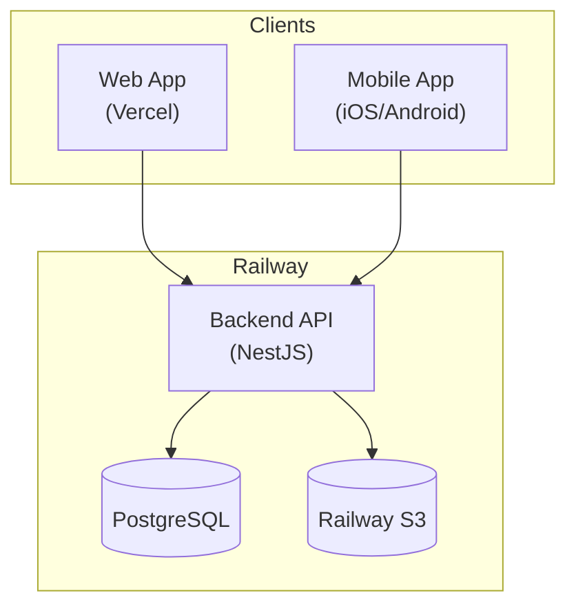
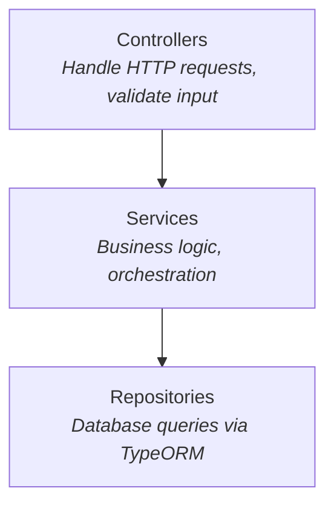
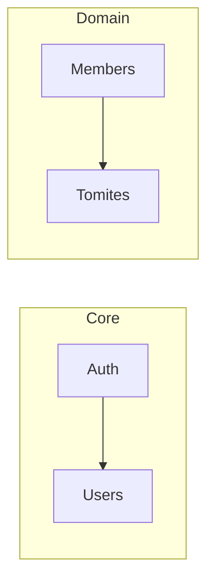
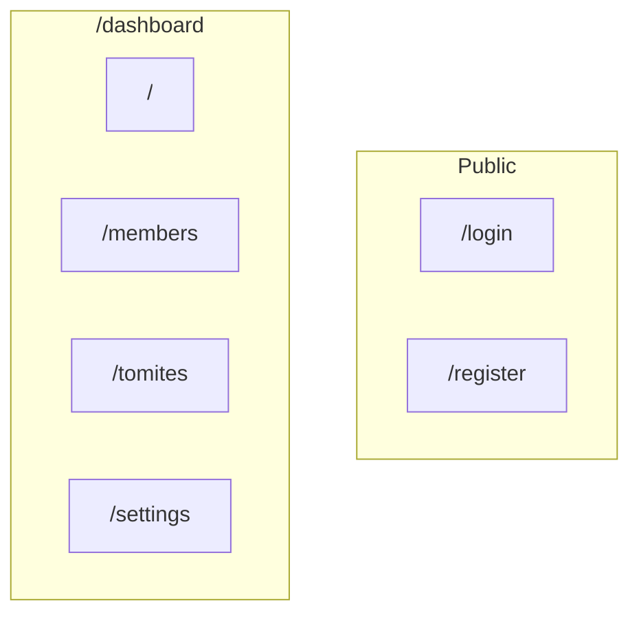
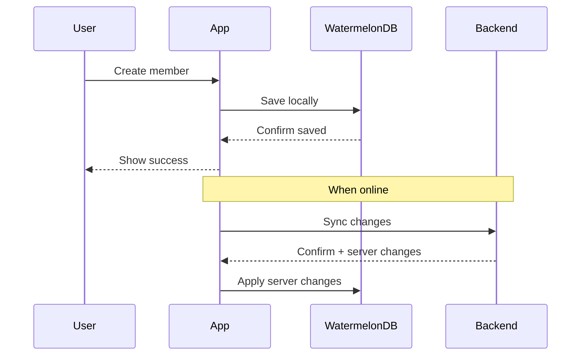
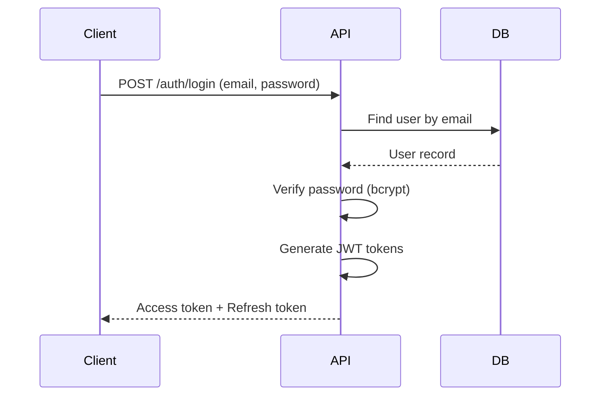

# Architecture

This document explains the system architecture and the reasoning behind key design decisions.

---

## System Overview

### Why This Architecture?

**Separation of frontend and backend hosting**: The frontend is deployed on Vercel while the backend runs on Railway. This separation allows each platform to optimize for its specific use case—Vercel excels at serving static assets and edge rendering, while Railway provides a stable environment for long-running API processes.

**Single database**: We use one PostgreSQL instance for all data. For a project of this scale, the complexity of microservices or multiple databases is not justified. TypeORM handles schema migrations, making it easy to evolve the data model.

**S3-compatible storage**: File uploads (member photos, documents) are stored in Railway's S3-compatible storage. This keeps binary data out of the database and provides a scalable storage solution.

---

## Backend Architecture

### Layer Architecture

### Why Layers?

**Testability**: Each layer can be tested in isolation. Controllers are tested with HTTP mocks, services with repository mocks, and repositories with a test database.

**Single responsibility**: Controllers only handle HTTP concerns (parsing requests, formatting responses). Business rules live in services. Data access is encapsulated in repositories.

**Dependency direction**: Dependencies flow downward. Controllers depend on services, services depend on repositories. This makes it easy to swap implementations (e.g., a different storage backend).

### Module Structure

**Auth module**: Handles JWT token generation, validation, and refresh. Depends on Users module to verify credentials.

**Users module**: Manages user accounts (admins, managers). Separate from Members because a user account (login) is distinct from a member profile (party membership).

**Members module**: Core domain logic for member management. Depends on Tomites because every member belongs to a tomite.

**Tomites module**: Manages local sections. Independent module with no external dependencies.

---

## Frontend Architecture

### Why App Router?

Next.js 14's App Router was chosen over the Pages Router for these reasons:

1. **Server Components by default**: Most pages can render entirely on the server, reducing client JavaScript. This is important for users on slower connections.

2. **Nested layouts**: The dashboard layout (sidebar, header) is defined once and shared across all dashboard routes without prop drilling.

3. **Colocation**: Loading states, error boundaries, and page components live in the same directory, making the codebase easier to navigate.

### Route Structure

**Public routes**: Login and register pages are accessible without authentication.

**Dashboard routes**: Protected by middleware that checks for a valid JWT. All dashboard pages share a common layout with sidebar navigation.

---

## Mobile Architecture

### Offline-First Design

### Why Offline-First?

**Geographical reality**: French Polynesia spans an area the size of Western Europe. Many islands have limited or unreliable internet connectivity. Field workers must be able to register members without waiting for network access.

**User experience**: Writes are instant because they go to the local database first. The user doesn't wait for network round-trips.

**Conflict resolution**: WatermelonDB tracks changes with timestamps. When syncing, the server acts as the source of truth, but local changes are preserved and merged intelligently.

---

## Security Architecture

### Authentication Flow

### Why JWT?

**Stateless**: The backend doesn't need to store session data. Each request carries its own authentication proof, which scales better across multiple server instances.

**Mobile-friendly**: JWTs work naturally with mobile apps where traditional cookie-based sessions are problematic.

**Refresh tokens**: Short-lived access tokens (24h) limit the damage if a token is compromised. Refresh tokens (7d) allow seamless re-authentication without forcing users to log in frequently.

### Role-Based Access Control

| Role | Scope | Capabilities |
| ---- | ----- | ------------ |
| **Admin** | System-wide | Full access to all data and settings |
| **Manager** | Own tomite | Manage members in their assigned tomite |
| **Member** | Own data | View own profile, limited read access |

**Why RBAC?**: The organizational structure of political parties maps naturally to roles. Tomite managers need autonomy to manage their sections without accessing other sections' data. Admins need oversight across all sections.
