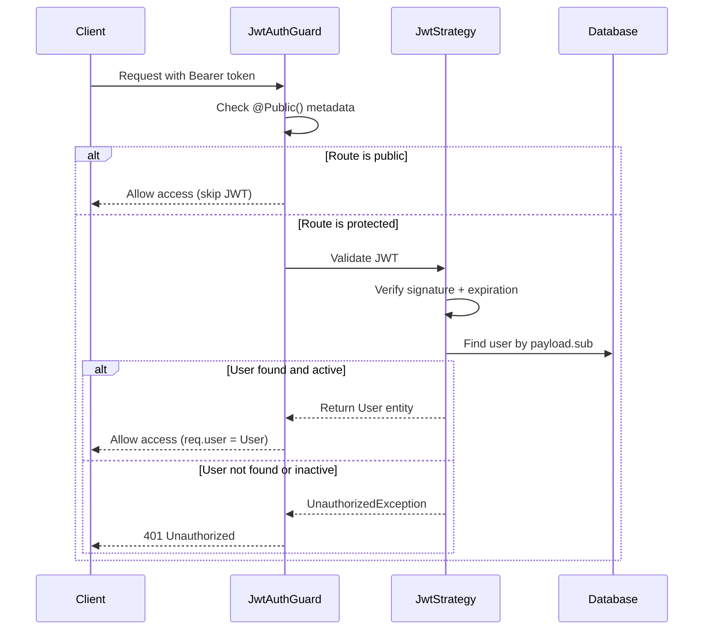

# JWT Authentication

This document covers the JWT (JSON Web Token) implementation in Faatere, including token structure, validation strategy, global route protection, and custom decorators.

---

## Token Structure

Faatere uses signed JWTs with the following payload:

```typescript
interface JwtPayload {
  sub: string;   // User ID (UUID)
  email: string; // User email
  role: string;  // User role (admin, manager, member)
  iat: number;   // Issued at (auto-added by jsonwebtoken)
  exp: number;   // Expiration (auto-added by jsonwebtoken)
}
```

| Field | Description | Example |
|-------|-------------|---------|
| `sub` | User UUID, standard JWT subject claim | `"a1b2c3d4-..."` |
| `email` | User's email address | `"user@example.com"` |
| `role` | Role in the system | `"admin"` |
| `iat` | Unix timestamp when the token was issued | `1738713600` |
| `exp` | Unix timestamp when the token expires | `1738800000` |

### Token Lifetimes

| Token Type | Lifetime | Use Case |
|------------|----------|----------|
| Access Token | **24 hours** | API request authorization |
| Refresh Token | **7 days** | Obtaining a new access token without re-login |

### Configuration

The JWT secret is loaded from the application configuration:

```typescript
// auth.module.ts
JwtModule.registerAsync({
  inject: [ConfigService],
  useFactory: (configService: ConfigService) => ({
    secret: configService.get<string>('jwt.secret'),
    signOptions: { expiresIn: '24h' },
  }),
})
```

The secret is configured via environment variable and should be a strong, random string (minimum 256 bits).

---

## Validation Strategy

JWT validation is handled by Passport.js with a custom `JwtStrategy`.

### How It Works



### JwtStrategy Implementation

The strategy extracts the JWT from the `Authorization: Bearer <token>` header:

```typescript
@Injectable()
export class JwtStrategy extends PassportStrategy(Strategy) {
  constructor(configService: ConfigService, userRepository: Repository<User>) {
    super({
      jwtFromRequest: ExtractJwt.fromAuthHeaderAsBearerToken(),
      ignoreExpiration: false,
      secretOrKey: configService.get<string>('jwt.secret'),
    });
  }

  async validate(payload: JwtPayload): Promise<User> {
    const user = await this.userRepository.findOne({
      where: { id: payload.sub },
    });

    if (!user) throw new UnauthorizedException('User not found');
    if (!user.isActive) throw new UnauthorizedException('Account is disabled');

    return user; // Attached to request as req.user
  }
}
```

Key behaviors:
- **Token extraction**: From `Authorization: Bearer <token>` header
- **Expiration**: Enforced automatically (`ignoreExpiration: false`)
- **User lookup**: Every request validates that the user still exists and is active
- **Disabled accounts**: Rejected even if the token is technically valid

---

## Global Route Protection

All API routes are **protected by default**. This is achieved by registering `JwtAuthGuard` as a global guard in `AppModule`.

### Registration

```typescript
// app.module.ts
@Module({
  providers: [
    {
      provide: APP_GUARD,
      useClass: JwtAuthGuard,
    },
  ],
})
export class AppModule {}
```

This means every route in the application requires a valid JWT unless explicitly marked as public.

### JwtAuthGuard

The guard checks for the `@Public()` decorator before enforcing JWT validation:

```typescript
@Injectable()
export class JwtAuthGuard extends AuthGuard('jwt') {
  constructor(private readonly reflector: Reflector) {
    super();
  }

  canActivate(context: ExecutionContext) {
    const isPublic = this.reflector.getAllAndOverride<boolean>(IS_PUBLIC_KEY, [
      context.getHandler(),
      context.getClass(),
    ]);

    if (isPublic) return true;

    return super.canActivate(context);
  }
}
```

---

## Custom Decorators

### @Public()

Marks a route or controller as publicly accessible, bypassing JWT validation.

```typescript
import { SetMetadata } from '@nestjs/common';

export const IS_PUBLIC_KEY = 'isPublic';
export const Public = () => SetMetadata(IS_PUBLIC_KEY, true);
```

**Usage:**

```typescript
@Public()
@Post('login')
async login(@Request() req) {
  return this.authService.login(req.user);
}
```

Currently public routes:
- `POST /auth/login` - Login endpoint
- `POST /auth/refresh` - Token refresh endpoint

### @CurrentUser()

Extracts the authenticated user from the request object. Can optionally extract a specific property.

```typescript
// Get the full user object
@Get('profile')
getProfile(@CurrentUser() user: User) {
  return user;
}

// Get a specific property
@Get('my-id')
getMyId(@CurrentUser('id') userId: string) {
  return userId;
}
```

---

## Frontend Token Storage

On the client side, the access token is stored in `localStorage` and a companion cookie is set for Next.js middleware:

| Storage | Key | Purpose |
|---------|-----|---------|
| localStorage | `faatere_access_token` | Token for API requests (read by Axios interceptor) |
| localStorage | `faatere_refresh_token` | Refresh token for session renewal |
| Cookie | `faatere_auth` | Flag for Next.js middleware server-side auth check |

The cookie is a simple `true` flag (not the actual token) that enables the Next.js middleware to determine authentication status at the edge without accessing localStorage.

---

## Frontend Route Protection

Next.js middleware runs server-side on every navigation and checks the `faatere_auth` cookie:

```typescript
export function middleware(request: NextRequest) {
  // Allow public paths
  if (publicPaths.some((path) => pathname.startsWith(path))) {
    return NextResponse.next();
  }

  // Check for auth cookie
  const authCookie = request.cookies.get(AUTH_COOKIE_NAME);
  if (!authCookie) {
    const loginUrl = new URL('/login', request.url);
    loginUrl.searchParams.set('returnTo', pathname);
    return NextResponse.redirect(loginUrl);
  }

  return NextResponse.next();
}
```

**Public frontend paths:** `/login`, `/setup-password`

**Excluded from middleware:** API routes, `_next/static`, `_next/image`, `favicon.ico`

---

## Error Responses

| Status | Scenario |
|--------|----------|
| `401 Unauthorized` | Missing token, expired token, invalid signature, user not found |
| `403 Forbidden` | Account is disabled (valid token but inactive user) |
| `429 Too Many Requests` | Login rate limit exceeded (5 attempts/minute) |

---

## Source Files

| File | Description |
|------|-------------|
| `services/backend/src/modules/auth/strategies/jwt.strategy.ts` | JWT validation strategy |
| `services/backend/src/modules/auth/guards/jwt-auth.guard.ts` | Global JWT guard with @Public() support |
| `services/backend/src/modules/auth/decorators/public.decorator.ts` | @Public() decorator |
| `services/backend/src/modules/auth/decorators/current-user.decorator.ts` | @CurrentUser() decorator |
| `services/backend/src/modules/auth/auth.module.ts` | JWT module configuration |
| `services/backend/src/app.module.ts` | Global guard registration |
| `frontend/src/lib/auth.ts` | Client-side token storage |
| `frontend/src/middleware.ts` | Next.js route protection middleware |
