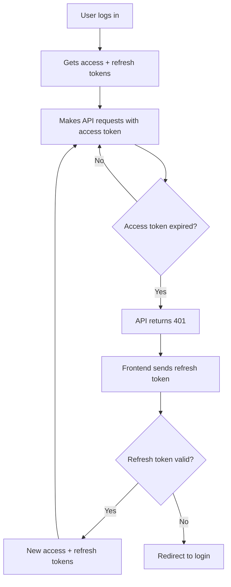
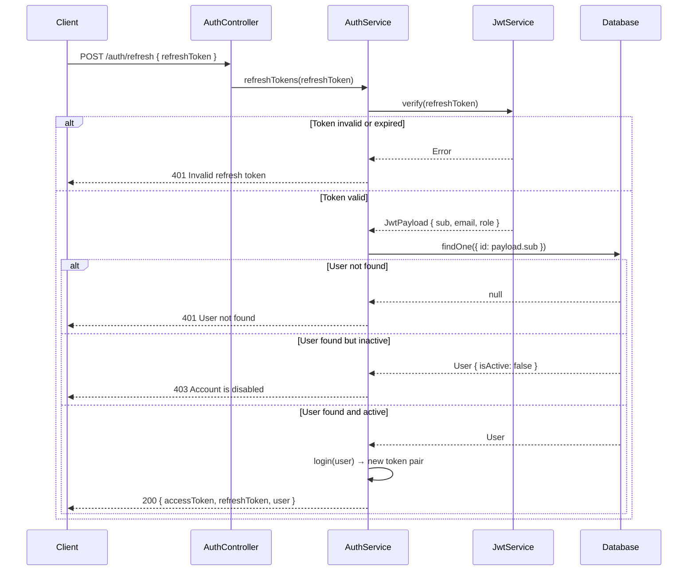
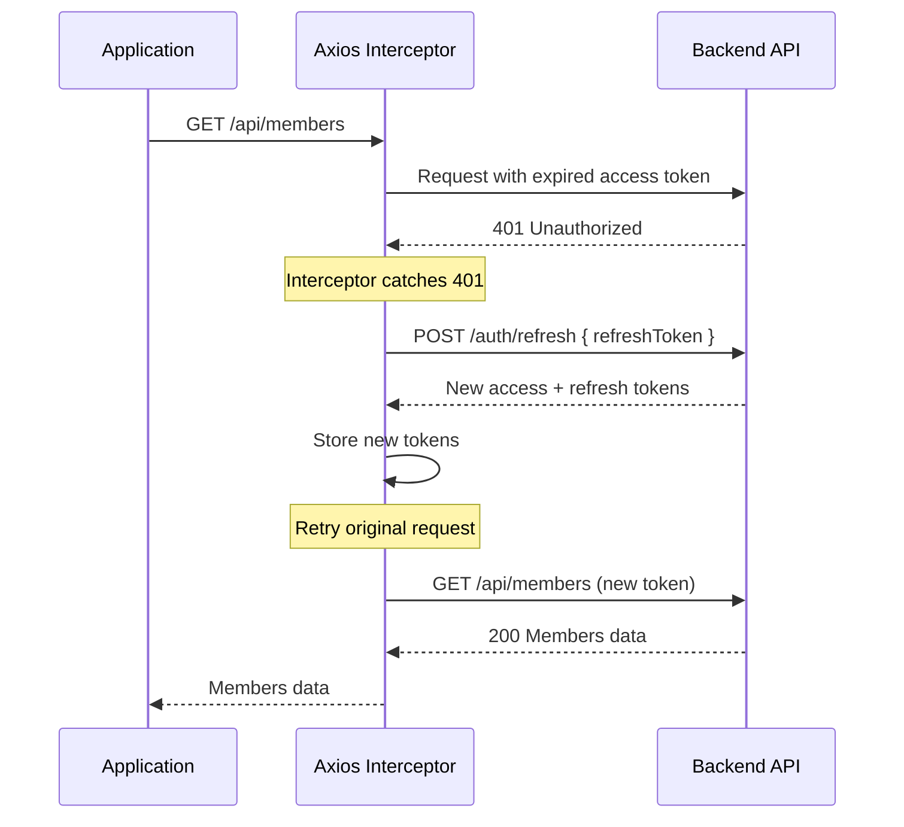
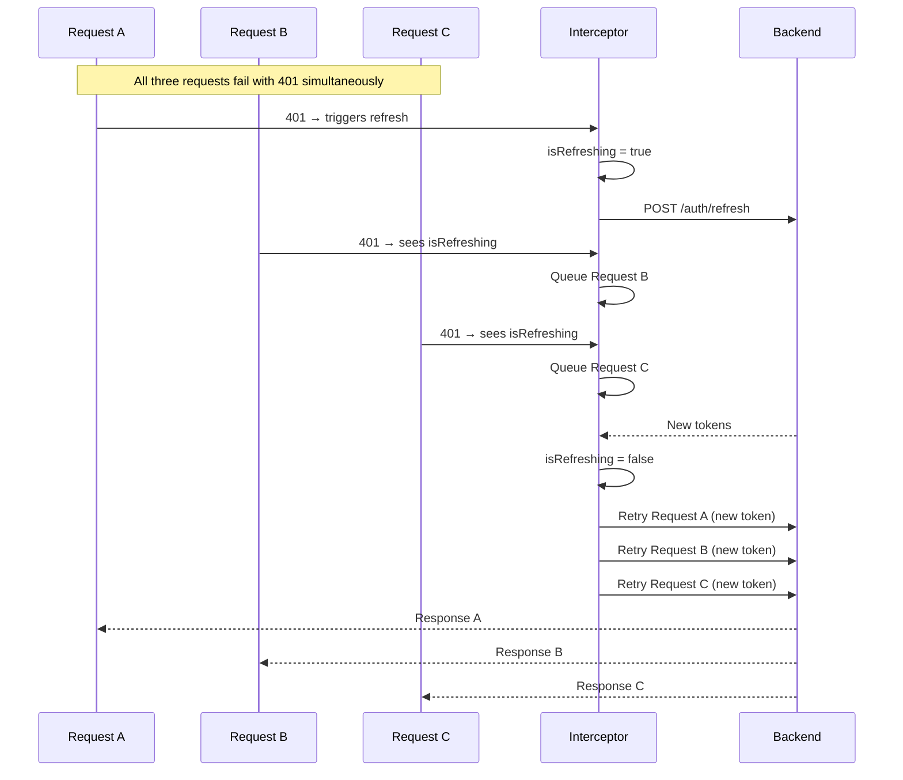

# Refresh Token

This document covers the refresh token mechanism in Faatere, including how tokens are issued, refreshed on the backend, and automatically renewed on the frontend with concurrent request queuing.

---

## Why Refresh Tokens?

Access tokens have a short lifetime (24 hours) for security. Without refresh tokens, users would need to re-enter their credentials every time the access token expires. Refresh tokens solve this by allowing **silent token renewal**:

- The user logs in once and gets both an access token and a refresh token
- When the access token expires, the frontend automatically uses the refresh token to get a new pair
- The user never notices the renewal — their session continues seamlessly
- If the refresh token itself expires (after 7 days of inactivity), the user must log in again



---

## Backend Implementation

### Token Generation

When a user logs in, `AuthService.login()` generates both tokens using the same JWT payload but with different expiration times:

```typescript
async login(user: User): Promise<AuthResponseDto> {
  const payload: JwtPayload = {
    sub: user.id,
    email: user.email,
    role: user.role,
  };

  // Access token: 24 hours (configured in JwtModule)
  const accessToken = this.jwtService.sign({ ...payload });

  // Refresh token: 7 days
  const refreshToken = this.jwtService.sign(
    { ...payload },
    { expiresIn: 604800 }, // 7 days in seconds
  );

  return { accessToken, refreshToken, user: { ... } };
}
```

### Token Refresh Endpoint

`POST /auth/refresh` validates the refresh token and issues a new token pair:



### Implementation

```typescript
async refreshTokens(refreshToken: string): Promise<AuthResponseDto> {
  try {
    const payload = this.jwtService.verify<JwtPayload>(refreshToken);

    const user = await this.userRepository.findOne({
      where: { id: payload.sub },
    });

    if (!user) throw new UnauthorizedException('User not found');
    if (!user.isActive) throw new ForbiddenException('Account is disabled');

    return this.login(user); // Issues fresh token pair
  } catch (error) {
    if (error instanceof ForbiddenException ||
        error instanceof UnauthorizedException) {
      throw error;
    }
    throw new UnauthorizedException('Invalid refresh token');
  }
}
```

Key behaviors:
- **Token rotation**: Every refresh generates a completely new token pair (both access and refresh)
- **User validation**: The user's existence and active status are verified on every refresh
- **Error handling**: Distinguishes between invalid tokens (401), not-found users (401), and disabled accounts (403)

---

## Frontend Implementation

### Automatic Token Refresh

The Axios response interceptor in `lib/api.ts` handles 401 responses by automatically attempting a token refresh:



### Concurrent Request Queuing

When multiple requests fail simultaneously with 401, only **one** refresh attempt is made. All other requests are queued and retried once the new token is available:



### Implementation

```typescript
let isRefreshing = false;
let refreshSubscribers: Array<(token: string) => void> = [];

function onRefreshComplete(newToken: string) {
  refreshSubscribers.forEach((callback) => callback(newToken));
  refreshSubscribers = [];
}

function addRefreshSubscriber(callback: (token: string) => void) {
  refreshSubscribers.push(callback);
}
```

The interceptor logic:

1. **Skip auth endpoints**: Requests to `/auth/login` and `/auth/refresh` are never retried
2. **First 401**: Sets `isRefreshing = true`, calls `/auth/refresh`, stores new tokens, retries queued requests
3. **Subsequent 401s during refresh**: Queued via `addRefreshSubscriber()` and resolved when refresh completes
4. **Refresh failure**: Clears all tokens, empties subscriber queue, redirects to `/login`

### Failure Handling

When token refresh fails (expired refresh token, server error, etc.):

```typescript
catch {
  clearTokens();               // Remove all stored tokens
  refreshSubscribers = [];     // Clear queued requests
  if (typeof window !== 'undefined') {
    window.location.href = '/login';  // Redirect to login
  }
  return Promise.reject(error);
}
```

This ensures a clean session termination:
- `localStorage` tokens are removed
- The `faatere_auth` cookie is cleared (so middleware also redirects)
- All pending requests are dropped
- The user is sent to the login page

---

## Token Storage

| Storage | Key | Content | Purpose |
|---------|-----|---------|---------|
| localStorage | `faatere_access_token` | JWT string | API request authorization via Axios interceptor |
| localStorage | `faatere_refresh_token` | JWT string | Token renewal when access token expires |
| Cookie | `faatere_auth` | `"true"` | Server-side middleware auth check (not the actual token) |

### Why a Cookie Flag?

Next.js middleware runs at the edge (server-side) and cannot access `localStorage`. The `faatere_auth` cookie acts as a lightweight signal:

- Set to `"true"` when user logs in (alongside localStorage tokens)
- Cleared when tokens are cleared (logout or refresh failure)
- Middleware reads this cookie to decide if a redirect to `/login` is needed
- The cookie expires after 24 hours (matching access token lifetime), providing an additional safety net

---

## Security Considerations

| Aspect | Implementation |
|--------|---------------|
| **Token rotation** | New refresh token issued on every refresh (prevents reuse) |
| **Account status check** | User active status verified on every refresh |
| **Rate limiting** | Login endpoint: 5 attempts/minute (refresh skips throttle) |
| **Concurrent safety** | Only one refresh at a time, requests queued during refresh |
| **Clean failure** | All tokens cleared on refresh failure, immediate redirect |
| **Auth endpoint exclusion** | `/auth/login` and `/auth/refresh` never trigger auto-refresh loops |

---

## Source Files

| File | Description |
|------|-------------|
| `services/backend/src/modules/auth/auth.service.ts` | `login()` and `refreshTokens()` methods |
| `services/backend/src/modules/auth/auth.controller.ts` | `POST /auth/refresh` endpoint |
| `frontend/src/lib/api.ts` | Axios interceptor with automatic refresh and request queuing |
| `frontend/src/lib/auth.ts` | Token storage helpers (`setToken`, `clearTokens`, etc.) |
