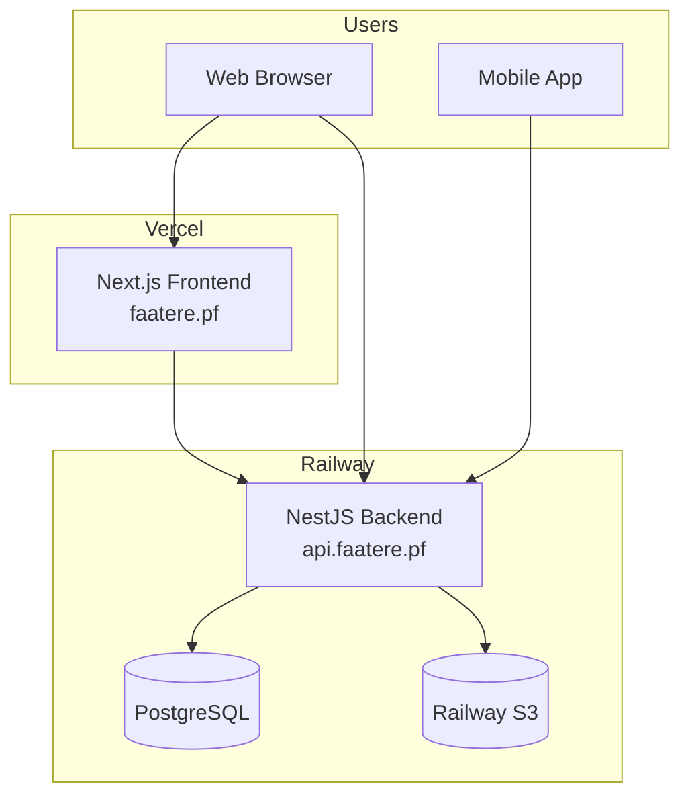

# Deployment

This guide covers deploying Faatere to production using Railway (backend) and Vercel (frontend).

---

## Architecture Overview



### Why This Setup?

**Vercel for frontend**: Next.js is developed by Vercel, so deployment is zero-configuration. Preview deployments on every PR, automatic HTTPS, and global CDN are included.

**Railway for backend**: Railway provides managed PostgreSQL and S3-compatible storage alongside the API, simplifying infrastructure. Automatic deployments from GitHub and built-in monitoring reduce operational overhead.

**Mobile app**: The mobile app connects directly to the Railway backend. App store deployment will be handled in a later phase.

---

## Backend Deployment (Railway)

### 1. Create Railway Project

1. Go to [railway.app](https://railway.app) and sign in with GitHub
2. Click **New Project** → **Deploy from GitHub repo**
3. Select the `faatere` repository
4. Railway will detect the monorepo structure

### 2. Configure Backend Service

1. Click **Add Service** → **GitHub Repo**
2. Set the **Root Directory** to `services/backend`
3. Railway will auto-detect the Dockerfile

### 3. Add PostgreSQL

1. Click **Add Service** → **Database** → **PostgreSQL**
2. Railway automatically provisions and connects the database
3. The `DATABASE_URL` environment variable is set automatically

### 4. Add S3 Storage

1. Click **Add Service** → **Volume** or use Railway's S3-compatible storage
2. Configure the following environment variables:

```
S3_ENDPOINT=<railway-s3-endpoint>
S3_ACCESS_KEY=<your-access-key>
S3_SECRET_KEY=<your-secret-key>
S3_BUCKET=faatere-uploads
```

### 5. Set Environment Variables

In the backend service settings, add:

```
NODE_ENV=production
JWT_SECRET=<generate-a-secure-random-string>
JWT_EXPIRATION=24h
FRONTEND_URL=https://faatere.pf
CORS_ORIGIN=https://faatere.pf
```

### 6. Configure Domain

1. Go to **Settings** → **Networking** → **Public Networking**
2. Add custom domain: `api.faatere.pf`
3. Configure DNS with your domain provider

### 7. Deploy

Railway automatically deploys on every push to `main`. Manual deploys can be triggered from the dashboard.

---

## Frontend Deployment (Vercel)

### 1. Import Project

1. Go to [vercel.com](https://vercel.com) and sign in with GitHub
2. Click **Add New** → **Project**
3. Import the `faatere` repository

### 2. Configure Build Settings

| Setting | Value |
| ------- | ----- |
| Framework Preset | Next.js |
| Root Directory | `frontend` |
| Build Command | `yarn build` |
| Output Directory | `.next` |

### 3. Set Environment Variables

```
NEXT_PUBLIC_API_URL=https://api.faatere.pf
NEXT_PUBLIC_APP_NAME=Faatere
```

### 4. Configure Domain

1. Go to **Settings** → **Domains**
2. Add `faatere.pf` and `www.faatere.pf`
3. Configure DNS records as shown by Vercel

### 5. Deploy

Vercel automatically deploys on every push to `main`. Preview deployments are created for every pull request.

---

## Mobile App Deployment

Mobile deployment will be configured in a later phase (v1.1). The plan:

- **iOS**: TestFlight for beta testing, App Store for production
- **Android**: Google Play Internal Testing, then Production

The mobile app will connect to the same Railway backend at `api.faatere.pf`.

---

## Environment Summary

| Environment | Frontend | Backend | Database |
| ----------- | -------- | ------- | -------- |
| Development | localhost:3000 | localhost:3001 | Docker PostgreSQL |
| Production | faatere.pf (Vercel) | api.faatere.pf (Railway) | Railway PostgreSQL |

---

## Monitoring

### Railway

Railway provides built-in monitoring:

- **Logs**: Real-time log streaming in the dashboard
- **Metrics**: CPU, memory, and network usage graphs
- **Alerts**: Configure alerts for service failures

### Vercel

Vercel provides:

- **Analytics**: Page views and performance metrics
- **Logs**: Function invocation logs
- **Speed Insights**: Core Web Vitals monitoring

---

## Database Migrations

Run migrations manually after deployment or configure Railway to run them as a release command:

```bash
# Via Railway CLI
railway run yarn migration:run

# Or configure in railway.json
{
  "build": { "builder": "dockerfile" },
  "deploy": { "releaseCommand": "yarn migration:run" }
}
```

---

## Rollback

### Railway

1. Go to **Deployments** in the service dashboard
2. Find the previous working deployment
3. Click **Redeploy**

### Vercel

1. Go to **Deployments** in the project dashboard
2. Find the previous working deployment
3. Click **...** → **Promote to Production**
