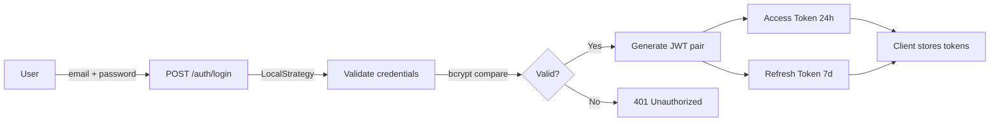
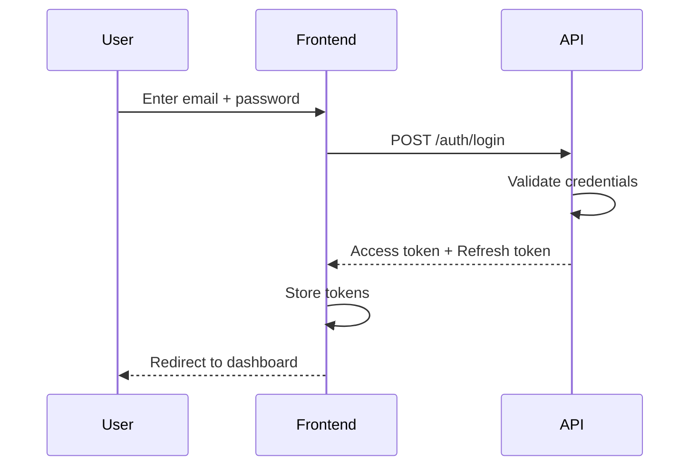
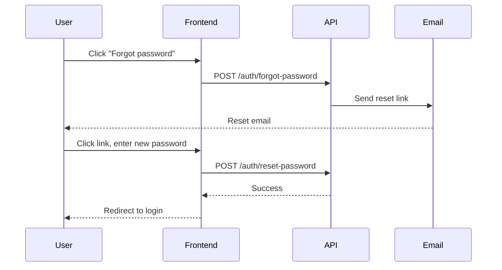

# Authentication

The Faatere authentication system provides secure access to the application using **JWT-based authentication** with **automatic token refresh**. It covers both the NestJS backend API and the Next.js frontend.

---

## Overview

The authentication flow is built on industry-standard patterns:

- **Backend**: NestJS with Passport.js, JWT strategy, and global route protection
- **Frontend**: Next.js middleware for server-side route protection, Axios interceptors for client-side token management
- **Token strategy**: Short-lived access tokens (24h) paired with longer-lived refresh tokens (7d)



---

## Sub-documentation

| Topic | Description |
|-------|-------------|
| [JWT Authentication](auth/jwt) | JWT token structure, validation strategy, global route protection, and the `@Public()` decorator |
| [Refresh Token](auth/refresh-token) | Token refresh mechanism, automatic client-side refresh with request queuing, and session management |

---

## API Endpoints

| Method | Endpoint | Auth | Description |
|--------|----------|------|-------------|
| `POST` | `/auth/login` | Public | Login with email and password |
| `POST` | `/auth/refresh` | Public | Refresh token pair |
| `GET` | `/auth/me` | Protected | Get current user profile |

### Login

```
POST /auth/login
Content-Type: application/json

{
  "email": "user@example.com",
  "password": "password123"
}
```

**Response (200):**
```json
{
  "accessToken": "eyJhbGciOiJIUzI1NiIs...",
  "refreshToken": "eyJhbGciOiJIUzI1NiIs...",
  "user": {
    "id": "uuid",
    "email": "user@example.com",
    "role": "admin",
    "tomiteId": "uuid",
    "isActive": true
  }
}
```

**Rate limiting:** 5 attempts per minute per IP.

### Refresh

```
POST /auth/refresh
Content-Type: application/json

{
  "refreshToken": "eyJhbGciOiJIUzI1NiIs..."
}
```

**Response (200):** Same structure as login response with new token pair.

### Get Profile

```
GET /auth/me
Authorization: Bearer <access_token>
```

**Response (200):**
```json
{
  "id": "uuid",
  "email": "user@example.com",
  "role": "admin",
  "tomiteId": "uuid",
  "isActive": true
}
```

---

## User Stories

### Login

> As a **user**, I want to log in with my email and password so that I can access the application.



**Acceptance criteria:**
- User can log in with valid email and password
- Invalid credentials show an error message
- Successful login redirects to the dashboard
- Tokens are stored securely (httpOnly cookies for web, secure storage for mobile)

---

### Logout

> As a **user**, I want to log out so that my session is terminated and my account is secure.

**Acceptance criteria:**
- Clicking logout clears all stored tokens
- User is redirected to the login page
- Subsequent API requests fail with 401

---

### Password Reset

> As a **user**, I want to reset my password if I forget it so that I can regain access to my account.



**Acceptance criteria:**
- User receives a reset email within 5 minutes
- Reset link expires after 1 hour
- Password must meet minimum requirements (8 chars, 1 number)
- Old password no longer works after reset

---

### Session Refresh

> As a **user**, I want my session to stay active while I'm using the app so that I don't have to log in repeatedly.

See [Refresh Token documentation](auth/refresh-token) for detailed implementation.

**Acceptance criteria:**
- Access tokens expire after 24 hours
- Refresh tokens expire after 7 days
- Token refresh happens automatically without user interaction
- If refresh fails, user is redirected to login

---

## Roles and Permissions

> As an **admin**, I want to assign roles to users so that they have appropriate access levels.

### Role Hierarchy

| Role | Description | Access |
| ---- | ----------- | ------ |
| **Admin** | System administrator | Full access to all data and settings |
| **Manager** | Tomite manager | Full access to their assigned tomite |
| **Member** | Regular member | Read-only access to own profile |

### Permission Matrix

| Resource | Admin | Manager | Member |
| -------- | ----- | ------- | ------ |
| All members | CRUD | - | - |
| Tomite members | CRUD | CRUD | - |
| Own profile | CRUD | CRUD | Read |
| Tomites | CRUD | Read own | Read own |
| Users | CRUD | - | - |
| Settings | CRUD | - | - |
