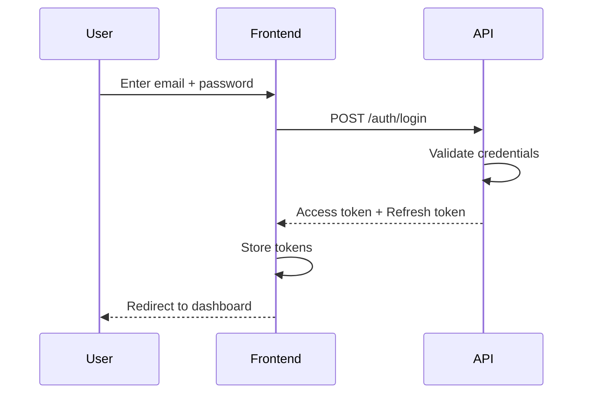
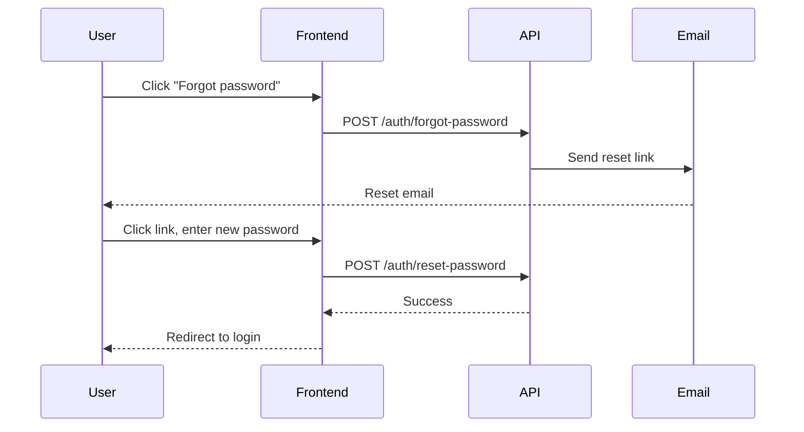
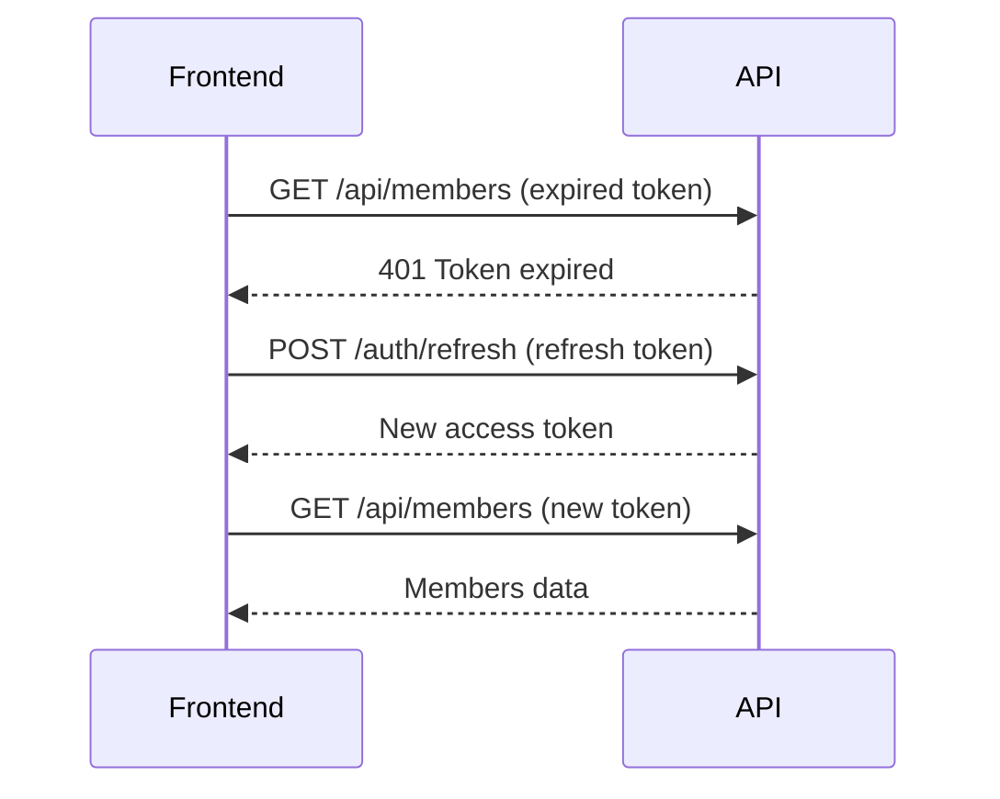

# Authentication

This document describes the authentication system and its user stories.

---

## User Stories

### Login

> As a **user**, I want to log in with my email and password so that I can access the application.

**Acceptance criteria:**
- User can log in with valid email and password
- Invalid credentials show an error message
- Successful login redirects to the dashboard
- Tokens are stored securely (httpOnly cookies for web, secure storage for mobile)

---

### Logout

> As a **user**, I want to log out so that my session is terminated and my account is secure.

**Acceptance criteria:**
- Clicking logout clears all stored tokens
- User is redirected to the login page
- Subsequent API requests fail with 401

---

### Password Reset

> As a **user**, I want to reset my password if I forget it so that I can regain access to my account.

**Acceptance criteria:**
- User receives a reset email within 5 minutes
- Reset link expires after 1 hour
- Password must meet minimum requirements (8 chars, 1 number)
- Old password no longer works after reset

---

### Session Refresh

> As a **user**, I want my session to stay active while I'm using the app so that I don't have to log in repeatedly.

**Acceptance criteria:**
- Access tokens expire after 24 hours
- Refresh tokens expire after 7 days
- Token refresh happens automatically without user interaction
- If refresh fails, user is redirected to login

---

## Roles and Permissions

> As an **admin**, I want to assign roles to users so that they have appropriate access levels.

### Role Hierarchy

| Role | Description | Access |
| ---- | ----------- | ------ |
| **Admin** | System administrator | Full access to all data and settings |
| **Manager** | Tomite manager | Full access to their assigned tomite |
| **Member** | Regular member | Read-only access to own profile |

### Permission Matrix

| Resource | Admin | Manager | Member |
| -------- | ----- | ------- | ------ |
| All members | CRUD | - | - |
| Tomite members | CRUD | CRUD | - |
| Own profile | CRUD | CRUD | Read |
| Tomites | CRUD | Read own | Read own |
| Users | CRUD | - | - |
| Settings | CRUD | - | - |

