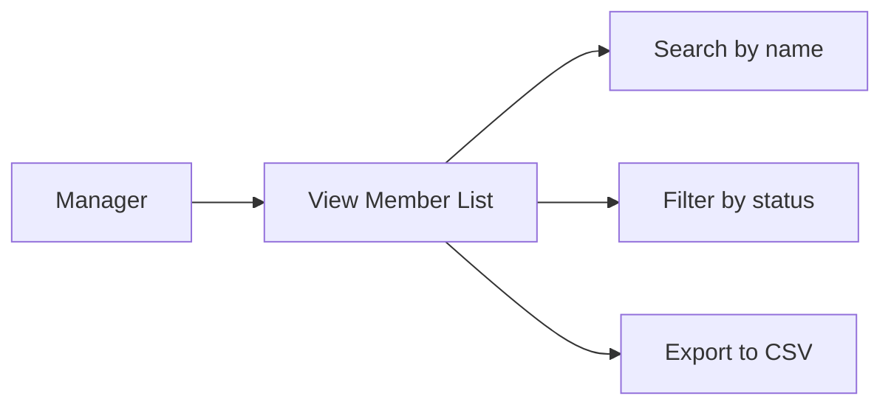
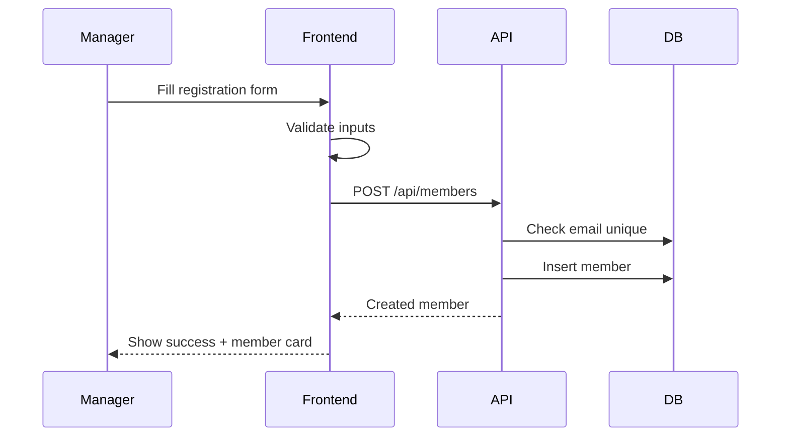
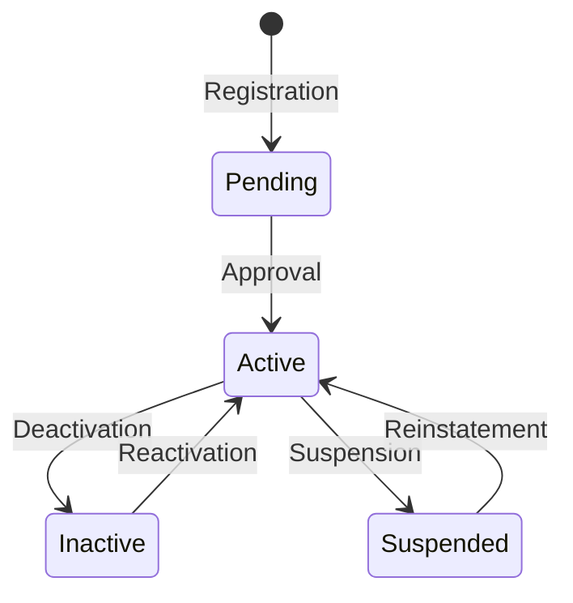
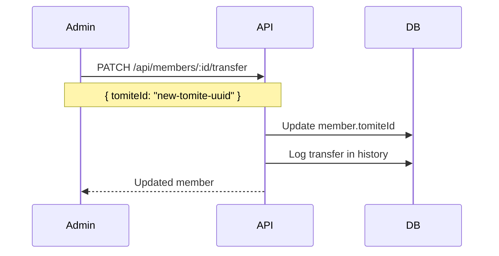
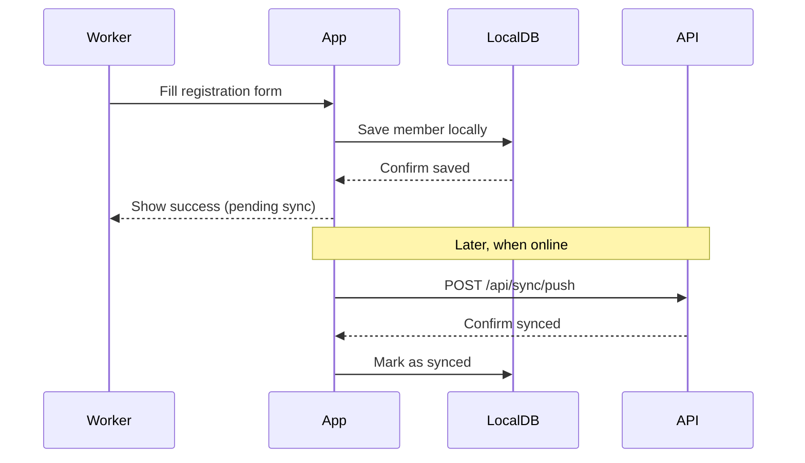
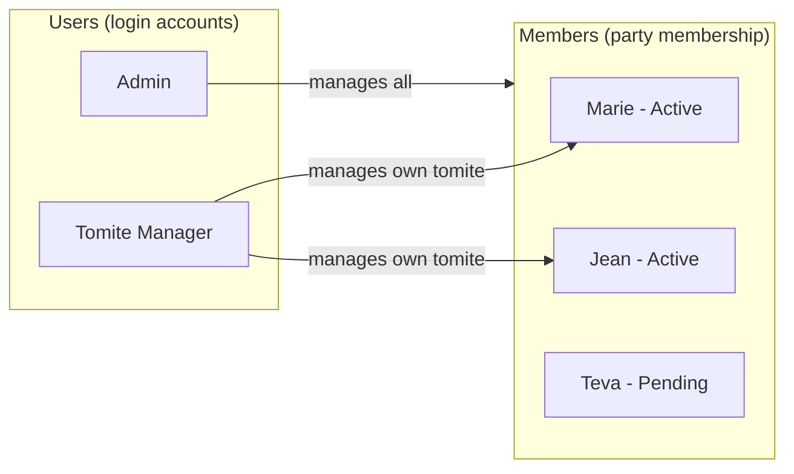

# Members

This document describes member management features and their user stories.

---

## User Stories

### List Members

> As a **tomite manager**, I want to see all members in my section so that I can manage local membership.

**Acceptance criteria:**
- List shows members belonging to the manager's tomite
- Pagination with 20 members per page
- Search filters by first name, last name, or email
- Status filter: all, active, inactive, pending
- Export downloads a CSV file with all filtered results

---

### Create Member

> As a **tomite manager**, I want to register a new member so that they are officially part of the party.

**Acceptance criteria:**
- Required fields: first name, last name, email
- Optional fields: phone, address, birth date
- Email must be unique across all members
- New members are created with "pending" status
- Manager receives confirmation with member details

---

### View Member Details

> As a **tomite manager**, I want to view a member's full profile so that I can see their history and contact information.

**Acceptance criteria:**
- Profile shows all member information
- Shows membership history (status changes, tomite transfers)
- Shows assigned tomite with link to tomite page
- Quick actions: edit, change status, transfer tomite

---

### Update Member

> As a **tomite manager**, I want to update a member's information so that records stay accurate.

**Acceptance criteria:**
- All fields except email can be edited
- Changes are saved immediately
- History log records who made the change and when

---

### Change Member Status

> As a **tomite manager**, I want to change a member's status so that I can track active vs inactive members.

**Acceptance criteria:**
- Status options: pending, active, inactive, suspended
- Status change requires a reason (dropdown + optional note)
- Email notification sent to member on status change
- History log records status changes

---

### Transfer Member

> As an **admin**, I want to transfer a member to a different tomite so that members can move between sections.

**Acceptance criteria:**
- Only admins can transfer members between tomites
- Transfer requires selecting the destination tomite
- Previous tomite manager loses access to the member
- New tomite manager gains access to the member
- Transfer is logged in member history

---

### Offline Member Registration (Mobile)

> As a **field worker**, I want to register members without internet so that I can work in remote areas.

**Acceptance criteria:**
- Registration form works without network
- Member is saved to local database immediately
- UI shows "pending sync" indicator
- Automatic sync when network becomes available
- Conflict resolution if same email registered elsewhere

---

## Member vs User

Faatere distinguishes between **Members** and **Users** because they serve different purposes:

| Concept | Member | User |
| ------- | ------ | ---- |
| **Purpose** | Party membership record | System login account |
| **Who** | People who joined the party | Admins and managers who operate the system |
| **Data** | Personal info, membership status, tomite affiliation | Email, password, role, permissions |
| **Count** | Thousands (all party members) | Dozens (staff who manage the system) |

**Key differences:**

- A **Member** is anyone who has joined the political party. They may not have a login account.
- A **User** is someone who logs into Faatere to manage members. Users are typically party staff.
- A tomite manager is a **User** who may or may not also be a **Member** of the party.
- Not all members need to access the system—most members are simply records managed by staff.
