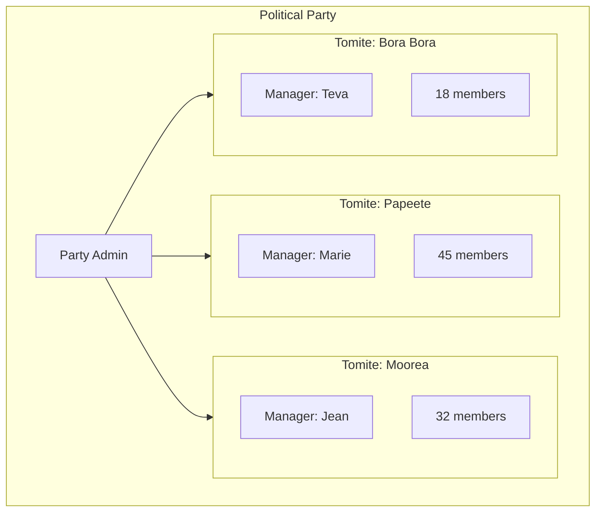
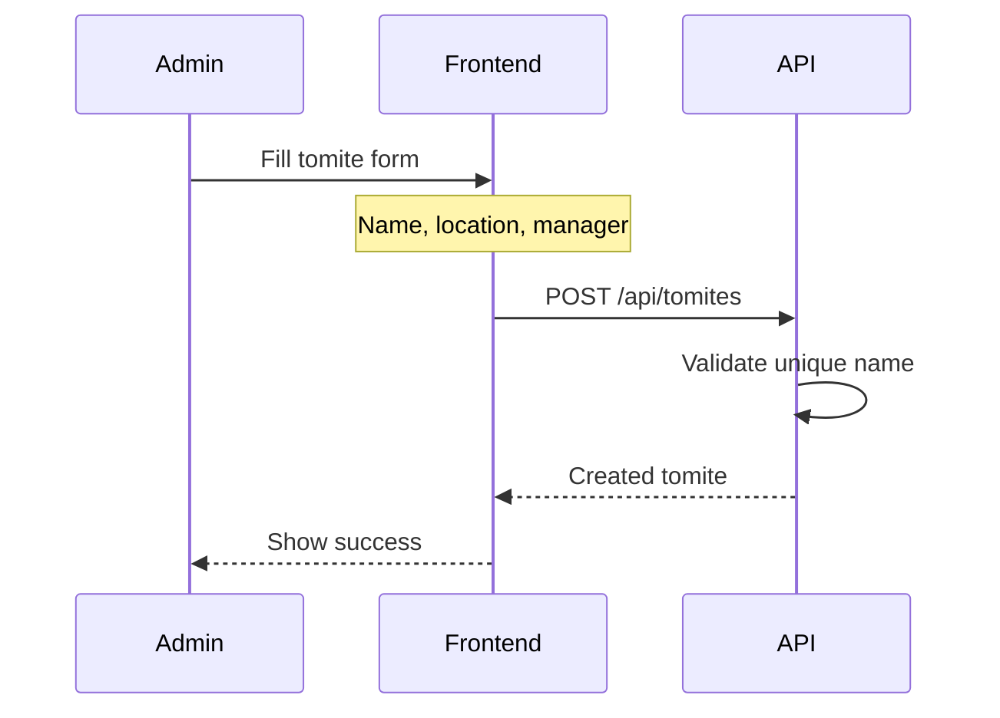
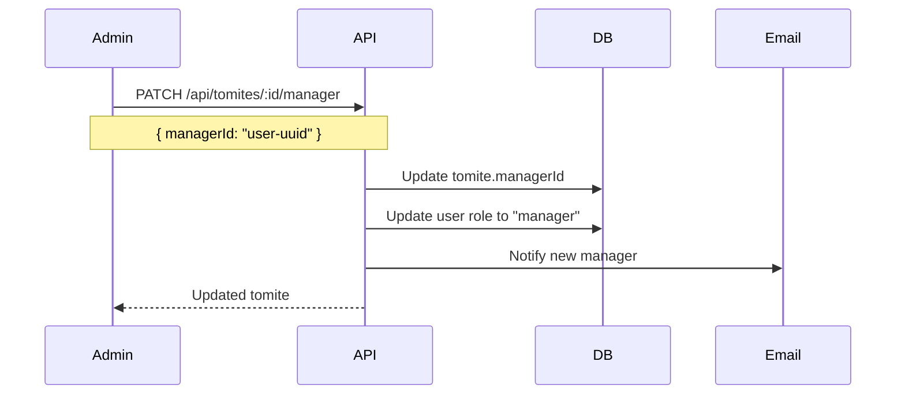
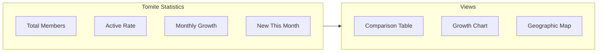

# Tomites

This document describes tomite (local section) management features and their user stories.

---

## What is a Tomite?

A **tomite** is a local section of the political party, typically organized by geographic area. Each tomite:

- Has a designated manager responsible for local operations
- Contains members who live or work in that area
- Reports membership statistics to party leadership

---

## User Stories

### List Tomites

> As an **admin**, I want to see all tomites so that I can monitor party organization across all regions.

**Acceptance criteria:**
- List shows all tomites with member count
- Sorted alphabetically by default
- Shows assigned manager for each tomite
- Quick stats: total members, active members, new this month

---

### Create Tomite

> As an **admin**, I want to create a new tomite so that the party can expand to new areas.

**Acceptance criteria:**
- Required fields: name, location
- Optional: assign manager immediately
- Name must be unique across all tomites
- Location can be free text (city, island, district)

---

### View Tomite Details

> As a **tomite manager**, I want to see my tomite's dashboard so that I can monitor local activity.

**Acceptance criteria:**
- Shows tomite information (name, location, manager)
- Member statistics with trends
- Recent member activity (new registrations, status changes)
- Quick access to member list filtered by this tomite

---

### Update Tomite

> As an **admin**, I want to update tomite information so that records stay accurate.

**Acceptance criteria:**
- Can edit name and location
- Changing name updates all references
- History log tracks changes

---

### Assign Manager

> As an **admin**, I want to assign a manager to a tomite so that someone is responsible for local operations.

**Acceptance criteria:**
- Select from existing users
- New manager receives email notification
- Previous manager (if any) loses manager role
- Manager can only manage one tomite

---

### View Tomite Statistics

> As an **admin**, I want to see statistics across all tomites so that I can compare performance.

**Acceptance criteria:**
- Table comparing all tomites side by side
- Sortable by any metric
- Growth trend over last 12 months
- Export to PDF for reports

---

### Tomite-Level Reports

> As a **tomite manager**, I want to generate reports for my tomite so that I can share with party leadership.

**Acceptance criteria:**
- Monthly membership report (PDF)
- Includes: member count, new members, departures, active rate
- Comparison with previous month
- Can be emailed directly to admin

